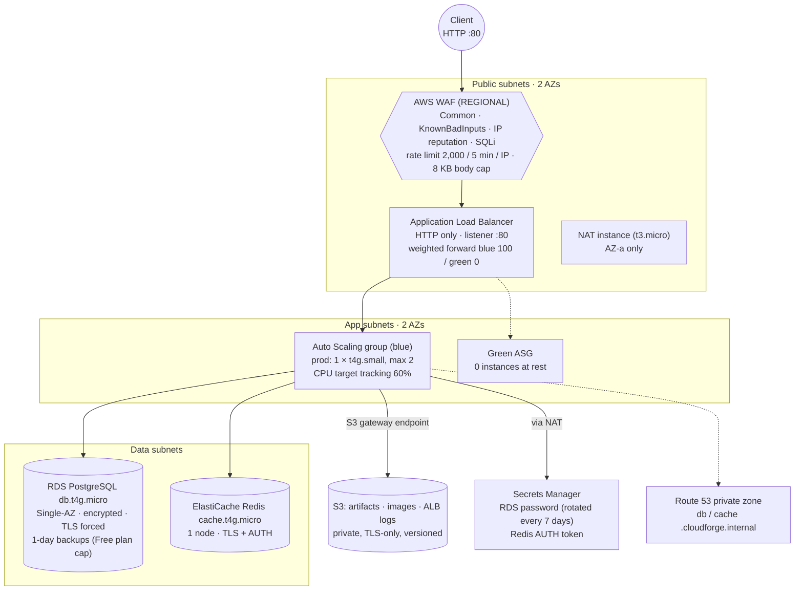

# CloudForge — As-Built Record and Finishing Plan

**Plan version:** 3.0 — 2026-10-03 (replaces the 2.0 build plan of 2026-09-04)
**Status:** M0–M10 complete. M11–M15 remaining, all scoped to finish, not to grow.
**Graduation:** June 2027. **Binding constraint:** AWS credit, not calendar time (§12).
**Positioning:** Flagship #2, paired with Pitstop. Pitstop = Kubernetes / GitOps / DevSecOps.
CloudForge = AWS / Terraform / infrastructure engineering / operations / reliability / cost.

**How to read this file.** Three kinds of content, kept apart on purpose:

- **As built** (§4–§8): the authoritative description of what exists today. If anything else in
  the repository disagrees with these sections, these sections win, and the other file is stale.
- **Historical** (§7, Appendix A): what was originally planned, kept only where the difference
  is itself worth explaining.
- **Remaining work** (§9): the only actionable part. Every task is tagged **MUST**, **NICE** or
  removed, judged by portfolio and interview value per hour and per dollar.

---

## Table of contents

| § | Section |
|---|---|
| 1 | Project purpose |
| 2 | What CloudForge proves |
| 3 | Non-goals |
| 4 | Current as-built architecture |
| 5 | Current operational state |
| 6 | Architecture decisions and conscious compromises |
| 7 | Completed work, M0–M10 |
| 8 | Real incidents and lessons learned |
| 9 | Remaining roadmap, M11–M15 |
| 10 | Measurements table |
| 11 | Portfolio artifacts |
| 12 | Cost strategy and credit runway |
| 13 | Known gaps and accepted risks |
| 14 | Interview preparation |
| 15 | Final Definition of Done |
| A | Appendix: the original plan, and what happened to it |
| B | Appendix: triage of every task left in plan 2.0 |
| C | Appendix: documentation rules |

---

## 1. Project purpose

CloudForge is a production-style AWS environment built entirely in Terraform and then operated:
deployed through CI, observed, broken, debugged and repaired. **The infrastructure and its
operation are the product.** The application, CloudStore, is a deliberately small Go API (about
1,000 lines plus tests) that exists so there is something real to deploy, load and break. Say
that plainly in the README.

---

## 2. What CloudForge proves

| Claim | Evidence today | Still missing |
|---|---|---|
| I can design AWS infrastructure and justify every choice | 26 ADRs, Well-Architected review, threat model, compromises table (§6) | — |
| I can build it reproducibly and test it | 8 Terraform modules, 108 `terraform test` runs, 2 environments from one module set, published public module | A timed full rebuild of prod (M11/M12) |
| I can deploy without long-lived CI credentials | GitHub OIDC, plan role (read-only) and apply role, approval-gated applies | — |
| I can observe a running system and detect failure | 12 metric alarms + 1 composite, 2 dashboards, Synthetics canary, structured logs | Fix the one alarm that never receives data (§9, C1) |
| I can debug real failures | 7+ real incidents and silent failures, found and fixed (§8), one SEV1 post-incident review | Story bank (M15) |
| I can restore data and know how long it takes | Final snapshot round trip on dev, nightly | A timed, verified restore with RPO/RTO vs target (M11) |
| I have measured recovery and performance behaviour | Deploy measurements (198 → 0 errors), rotation fix verification | 5 game days, capacity number (M12/M13) |
| I operate it like it costs money | Budget measured before credits, ephemeral dev, cost-driven ADRs | Cost analysis with real numbers, prod made ephemeral (M11/M13) |

---

## 3. Non-goals — protect this list

Do not add: Kubernetes, EKS, ECS, Argo CD, Istio, Jenkins, Vault, Kafka, Prometheus / Grafana /
Loki, Lambda microservices, a frontend, AI features, multi-region active-active.

Added in plan 3.0:

- **No AWS service added for breadth.** The project already has enough of them.
- **No infrastructure built only to make the original target architecture true** (NAT Gateway,
  Multi-AZ RDS, a second Redis node, CloudFront). These are documented compromises (§6), not
  unfinished work.
- **No infrastructure built only so an experiment can exist.** If an experiment needs a resource
  the as-built system doesn't have, the experiment is cut, not the architecture grown.
- **No recreating an incident that already happened naturally.** The real one is better evidence.

The test for any new idea: *"Does this produce a reliability measurement, operational proof,
engineering decision or portfolio artifact I cannot already demonstrate, and is it worth the
credit it burns?"* If not, cut it.

---

## 4. Current as-built architecture

Region `eu-west-3` (Paris), one AWS account on the **AWS Free plan** (credits, see §12).

**Cross-cutting, as built:**

| Observability | Security | Delivery and operations |
|---|---|---|
| CloudWatch agent: app JSON logs, memory, disk | IAM least privilege for the instance role (one documented `*` for `PutMetricData`) | GitHub Actions: `terraform.yml` (fmt, tflint, Checkov + 2 custom policies, `terraform test`, plan as PR comment, Infracost, approval-gated apply) |
| 12 metric alarms + 1 composite (`service-degraded`) → SNS → email | SSM Session Manager only: no SSH, no key pairs, IMDSv2 required | `app.yml`: test, vet, govulncheck, build arm64, deploy to dev with k6 gate |
| Golden Signals dashboard, SLO dashboard | GitHub OIDC to AWS, no static CI keys | `drift.yml`: daily `plan -detailed-exitcode`, opens an issue on drift |
| Synthetics canary on the ALB every 5 min + `canary-failed` alarm | CloudTrail (all regions, log validation, 365 days), IAM Access Analyzer, VPC Flow Logs | `nightly-destroy.yml`: dev destroyed at 23:00 UTC with a final snapshot |
| SLOs and error-budget policy (`docs/observability/slo.md`) | EBS encryption by default, RDS/Redis encrypted at rest and in transit | Rolling deploy (`scripts/deploy.sh`): instance refresh, launch-before-terminate, k6 gate |
| Budget measured **before** credits (`terraform/bootstrap/budget.tf`) | Checkov, gitleaks, tflint, terraform-docs in pre-commit and CI | Rebuilt environments converge on their own (ADR-026) |

**Terraform layout:** `terraform/bootstrap` (state bucket with native S3 locking, OIDC roles,
CloudTrail, Access Analyzer, budget, account settings; applied locally), 8 modules (`network`,
`edge`, `compute`, `database`, `cache`, `storage`, `observability`, `cicd-oidc`) and two
environment roots (`dev`, `prod`) with separate state. Dev and prod differ only in deletion
protection, log retention, `apply_immediately` and dev's gp3 storage (§13).

**Canonical diagram:** `docs/diagrams/architecture-high-level.md` holds the same as-built
diagram. Supporting diagrams: `network-vpc.md`, `traffic-flow.md`, `data-flow.md`,
`security-flow.md`.

---

## 5. Current operational state (2026-10-05)

| Item | State |
|---|---|
| **prod** | **Running continuously** since 2026-09-16 (serving since 2026-09-25): 1 app instance in `eu-west-3b`, NAT instance and RDS in `eu-west-3a`. `prod-down` / `prod-up` are committed but untested; prod remains up until Session A or an earlier credit-saving teardown. **Decision D1 (approved 2026-10-03):** prod becomes ephemeral, up only for implementation, experiments, validation or demos. |
| **dev** | Ephemeral. Destroyed nightly at 23:00 UTC with a final snapshot; rebuilt by any `terraform.yml` run, restoring the newest snapshot (ADR-026). Every prod apply rebuilds dev, because `apply (prod)` needs `apply (dev)`. |
| Credit | **56.39 USD** left (`aws freetier get-account-plan-state`, 2026-10-03). Free plan expires **2027-03-02**. |
| Account-plan risk | Per AWS's documentation, the Free plan **expires** six months after the account opened **or when the credits are used up**, whichever comes first. On expiry the account is closed and **access** to its resources and data is lost, but nothing is deleted at that point: AWS **retains the content for 90 days**, and upgrading to the Paid plan within those 90 days restores access. Only if no upgrade happens in that period does AWS **permanently delete** the account and its content. ([AWS Billing: Choosing a plan](https://docs.aws.amazon.com/awsaccountbilling/latest/aboutv2/free-tier-plans.html), [AWS Free Tier terms](https://aws.amazon.com/free/terms/), read 2026-10-03.) So running out of credit stops the project's AWS side until an upgrade; it is not just a bill. Even unspent, the plan expires on 2027-03-02, before graduation, so live demos after that date need an upgrade. The repository is unaffected. |
| Burn rate | **3.4–3.9 USD/day** before credits with prod up (Cost Explorer, 2026-09-28 to 10-02). About **16 days of runway** if nothing changes. |
| CI history | 106 workflow runs, 3 PRs (#1, #2, #5), 244 commits over 22 active days (2026-09-05 to 10-03). |
| Open issues | None. #7 (drift, prod) closed 2026-10-03: everything it reported (a newer Amazon Linux AMI on the launch template, a deploy description, the new `canary-failed` alarm) was code in `main` waiting for an apply, applied at 12:38 UTC. A read-only prod plan afterwards returned "No changes" (`-detailed-exitcode` 0). |
| C1 status | Applied 2026-10-05. Both ASGs publish `GroupInServiceInstances`; recent dev and prod datapoints are `1`, and the alarms use the environment floor (`1`), `Minimum`, and `treat_missing_data = missing`. The first dev replacement stayed at `1` because the replacement launched before termination completed, so no `ALARM` transition or notification was observed yet. |
| Unavailable on this plan | GuardDuty, Security Hub, Inspector, **AWS FIS** (`SubscriptionRequiredException`, FIS checked 2026-10-03), CloudFront (denied by AWS Support), RDS backup retention above 1 day. |
| Error budget | Availability budget for the 30 days after 2026-09-30 was spent about eleven times over by the 40-hour outage (§8). The window clears around 2026-10-31. |

---

## 6. Architecture decisions and conscious compromises

### 6.1 ADR index

| ADR | Decision | Status |
|---|---|---|
| 001 | Terraform S3 backend with native S3 locking | accepted |
| 002 | Separate state per environment | accepted |
| 003 | Graviton (`t4g`) for app, RDS, Redis | accepted (the NAT instance is x86 `t3.micro`) |
| 004 | App artifact = static Go binary in S3, pulled at boot | accepted |
| 005 | SSM Session Manager for all access | accepted |
| 006 | Shallow ALB health check (`/healthz`), deep `/readyz` monitored separately | accepted — and it hid the 2026-09-30 outage from the ALB, by design (§8) |
| 007 | Target tracking scaling | **partly built**: CPU policy only; the `ALBRequestCountPerTarget` policy was never added |
| 008 | NAT instance in dev, NAT Gateway in prod | **gateway never built**; prod runs the NAT instance too (gap recorded in the ADR) |
| 009 | RDS master password managed by Secrets Manager | accepted, with the 2026-10-01 correction: rotation was on from day one |
| 010 | One CloudFront distribution, two origins | superseded by 025 |
| 011 | No custom domain, CloudFront certificate for TLS | superseded by 025 (still no domain; now HTTP only) |
| 012 | Two environments, both ephemeral | accepted, **not followed for prod** since 2026-09-16 (M11 restores it) |
| 013 | Route 53 private hosted zone | accepted |
| 014 | ALB locked to CloudFront | superseded by 025 |
| 015 | Snapshot on down, restore on up | accepted (dev) |
| 016 | Terraform native tests for every module | accepted |
| 017 | Blue/green as a second deploy strategy | **built, never exercised end to end** |
| 018 | RDS-native recovery over AWS Backup | accepted |
| 019 | Scripted AWS CLI fault injection over AWS FIS | accepted |
| 020 | SLOs before game days | accepted |
| 021 | Long-lived admin key over IAM Identity Center | accepted |
| 022 | Redis TLS server name decoupled from dial address | accepted |
| 023 | What stays hardcoded in modules | accepted |
| 024 | Public cache module is a generalised copy | accepted |
| 025 | CloudFront denied: the ALB becomes the public edge | accepted |
| 026 | A rebuilt environment brings itself back | accepted |

### 6.2 Conscious compromises

Type key: **accepted risk** (understood and acceptable for this workload), **cost** (the
alternative is affordable in a real job, not on this credit), **plan limit** (AWS will not allow
it on this account or plan), **future** (would be done next with more time).

| Area | As built | Production-grade alternative | Why not used | Type |
|---|---|---|---|---|
| Edge TLS | ALB HTTP only, no HSTS (dropped, not moved, ADR-025) | CloudFront or an ACM certificate on the ALB with a custom domain, HTTPS only, HSTS | CloudFront denied by AWS Support; a domain reopens a recurring cost for a project with an end date | plan limit + cost |
| CDN | None; images served through the app | CloudFront with OAC for static objects | Denied (ADR-025) | plan limit |
| App tier | 1 instance in prod (ASG max 2) | ≥ 2 instances across AZs | Halves app-tier cost; the cost of one instance is measured in M12 (E1) instead of argued | cost |
| Database | RDS Single-AZ, 1-day automated backups | Multi-AZ, 7–35 day backups, cross-region copies | Multi-AZ roughly doubles the DB cost; the Free plan rejects retention above 1 day (`FreeTierRestrictionError`) | cost + plan limit |
| Cache | 1 Redis node, no failover | Replication group with automatic failover | Cost; the app fails open to Postgres, so a cache loss should degrade latency, not availability (tested in M12, E2) | cost, accepted risk |
| Egress | One NAT instance in AZ-a for both AZs | NAT Gateway per AZ | ~33 USD/month per gateway; a single egress point is a known SPOF (ADR-008) | cost |
| Accounts | Single account, dev and prod side by side | Separate accounts under AWS Organizations with SCPs | Creating an Organization moves the account off the Free plan and forfeits the credit (ADR-021) | plan limit |
| Human access | Long-lived `cloudforge-admin` key | IAM Identity Center, short-lived credentials | Same Organizations constraint (ADR-021) | plan limit |
| Threat detection | Access Analyzer, CloudTrail, Checkov, drift detection | GuardDuty, Security Hub, Inspector | `SubscriptionRequiredException` on the Free plan | plan limit |
| Chaos tooling | Scripted AWS CLI fault injection (M12) | AWS FIS experiment templates | FIS unavailable on the Free plan | plan limit |
| Encryption keys | AWS-managed keys; alert SNS topics unencrypted | Customer-managed KMS keys | CMK cost; CloudWatch cannot publish to topics encrypted with the AWS-managed SNS key (G12) | cost, accepted risk |
| CI apply role | `PowerUserAccess` + scoped IAM policy | Least-privilege apply role | Large effort for one person; compensated by OIDC branch scoping and approvals | accepted risk |
| Prod deploys | Manual `scripts/deploy.sh prod` | Promotion pipeline with automatic rollback | One fixed S3 key per artifact blocks ASG auto-rollback (OPS 6) | future |

---

## 7. Completed work, M0–M10

Short by design. Details live in the linked ADRs, docs and commit history.

**M0 — Foundations** · done 2026-09-05
Budget, billing alarm, Cost Anomaly Detection, root MFA, CloudTrail, `terraform/bootstrap`
state bucket with native locking, pre-commit hooks. ADR-001, 002, 021.
*Later finding:* none of the cost alerts could fire on credits (§8, #3).
*Evidence:* `docs/screenshots/00-foundations/`.

**M1 — Network** · done 2026-09-06
Three-tier VPC across two AZs, NAT instance, S3 gateway endpoint, flow logs, SSM-only access,
first `.tftest.hcl`. Destroy proven twice. ADR-005, 008, 012, 016.
*Finding:* three NAT-instance user-data bugs (`eth0`/`ens5`, missing iptables on the minimal
AMI, AMI drift replacing the instance), all in ADR-008.
*Evidence:* `docs/diagrams/network-vpc.md`, `docs/screenshots/01-networking/`.

**M2 — CloudStore API (Go)** · done 2026-09-06
CRUD + image upload, `/healthz` (shallow), `/readyz` (deep), `/whoami`, graceful shutdown, Redis
fail-open, JSON logs, arm64 static binary (~14 MB). *Evidence:* `docs/screenshots/02-application/`.

**M3 — Compute** · done 2026-09-09
Launch template (AL2023 ARM, IMDSv2), ASG, lifecycle hook, hand-written IAM. Manual termination
→ replacement healthy in 3m 8s. *Historical:* measured on dev with **two** instances and no
load, so it is not comparable to today's one-instance prod; E1 re-measures the current case.
ADR-003, 004, 007.
*Finding:* the 8-vCPU account quota blocked an instance refresh; raised to 16 on appeal.
*Evidence:* `docs/security/README.md` (IAM walkthrough), `docs/screenshots/03-compute/`.

**M4 — Load balancing and WAF** · built 2026-09-09 to 09-11, edge redesigned 2026-09-22
ALB with blue and green target groups, shallow health check, WAF. The original CloudFront-fronted
design was written and partly applied, then **AWS Support permanently denied CloudFront**. The
edge was redesigned rather than worked around: WAF at `REGIONAL` scope on the ALB, app-served
images, security headers in the app, HSTS dropped (ADR-025, superseding 010, 011, 014).
*Finding:* testing the new edge showed the WAF did not block SQL injection, and its 8 KB body
rule blocked every image upload. Both fixed and re-tested 2026-09-25.
*Evidence:* `docs/diagrams/traffic-flow.md` (verification section).

**M5 — RDS PostgreSQL** · done 2026-09-12
Private data tier, AWS-managed password (ADR-009), encryption, Performance Insights,
`rds.force_ssl`, private DNS, snapshot on down and restore on up (ADR-015).
*Finding:* the app SG had no egress to 5432 (ADR-009).
*Evidence:* `docs/screenshots/05-database/`.

**M6 — Cache and storage** · done 2026-09-16
ElastiCache Redis with TLS + AUTH, S3 buckets (artifacts, images, logs), TLS-only policies.
ADR-013, 022 (the Redis TLS hostname mismatch behind a private CNAME). The CloudFront half of M6
was never applied (ADR-025). *Evidence:* `docs/diagrams/data-flow.md`,
`docs/screenshots/06-cache-storage-cdn/`.

**M7 — Observability and SLOs** · done 2026-09-16, repaired in M10
CloudWatch agent, metric filters, 12 metric alarms, composite alarm, Golden Signals and SLO
dashboards, Synthetics canary, one runbook per alarm, SLOs before game days (ADR-020).
*Finding:* no alarm email was delivered until 2026-09-30 (§8, #2).
*Evidence:* `docs/observability/slo.md`, `docs/runbooks/`.

**M8 — CI/CD, testing, drift** · built 2026-09-16 to 09-18, repaired 2026-09-25 to 09-27
GitHub OIDC (`docs/security/github-oidc-trust-policy.md`), `terraform.yml`, `app.yml`,
`drift.yml`, `nightly-destroy.yml`, Infracost, k6 deploy gate, blue/green infrastructure
(ADR-017).
*Finding:* PR plans, drift detection and the nightly destroy had all silently failed (§8, #6).
Blue/green has never been run end to end.

**M9 — Module hardening** · done 2026-09-20
Variables with validation, terraform-docs READMEs, tests for all 8 modules, ADR-023 (what stays
hardcoded). **Public module:** `Mouad852/cache/aws` v0.1.0,
https://registry.terraform.io/modules/Mouad852/cache/aws (ADR-024).
*Evidence:* `docs/screenshots/09-modules/`.

**M10 — Security hardening and Well-Architected** · done 2026-10-03
Well-Architected review: **22 high risks → 16**, the six targeted all moved, the rest accepted
or planned with reasons. Also: threat model, encryption inventory, data classification, incident
response plan, deployment runbook, readiness checklist, two custom Checkov policies (bad-PR demo,
PR #1), Access Analyzer (0 active findings), CloudTrail in code, EBS default encryption, budget
measured before credits, request/dependency timeouts, the rotation fix, `canary-failed` alarm,
security-flow diagram. GuardDuty: unavailable, documented as accepted.
*Evidence:* `docs/security/`, `docs/incidents/`, `docs/screenshots/10-security/`.
Well-Architected milestones verified in the tool on 2026-10-03
(`aws wellarchitected list-milestones`): 1 "M10 baseline 2026-09-27" and 2 "M10 remediated
2026-10-03" (recorded 12:51 UTC).

---

## 8. Real incidents and lessons learned

These are among the strongest parts of the project. They are evidence, not embarrassment.
Never hide or soften them.

1. **Database password rotation took prod down for ~40 hours** (SEV1, 2026-09-30 → 10-01).
   - Symptom: every DB-backed request returned 500, while `/healthz` and the ALB stayed green.
   - Detection gap: the canary failed every run for 40 hours, but no alarm watched it, and one
     request per 5 minutes never crossed the 5xx threshold. Found by accident, during a deploy.
   - Root cause: the RDS-managed secret rotates every 7 days by default, and the app read the
     password once at boot.
   - Fix: a pgx `BeforeConnect` hook fetches the current secret for each new connection, with a
     test, and every 5xx now logs its cause.
   - Validation: a forced rotation, then 19 hours on the same instance, 230/230 requests OK.
   - Observability change: a `canary-failed` alarm and runbook.
   - Lesson: shallow health checks keep a broken dependency invisible to the load balancer, so
     the outside-in signal must alarm.
   - Report: `docs/incidents/2026-09-30-db-password-rotation.md`.
2. **No alarm had ever delivered an email** (M7 → 2026-09-29). The alert topics used the
   AWS-managed SNS key, which CloudWatch cannot use. Fixed with unencrypted topics, a test that
   keeps them so, and a forced alarm that verified delivery. `well-architected.md`, G12.
3. **No cost alert could fire on credits.** `EstimatedCharges` read 0 while September cost
   113.26 USD before credits. Replaced by a budget measured before credits, in code.
4. **No request deadlines** (REL 5). A hung Postgres held each request until the ALB's
   60-second timeout, and the "fail-open" Redis took 5 s per call. Fixed with a 10 s request
   deadline, server timeouts, 250 ms Redis calls and a Postgres connect timeout, measured in
   `app/timeouts_test.go`.
5. **Prod in CI was not the prod in the plan.** Multi-AZ, deletion protection, 7-day backups
   and 30-day logs lived only in a gitignored local tfvars that CI never read. Moved into
   committed defaults (Multi-AZ consciously left off, backups capped at 1 day by the plan).
6. **Automation that silently failed:**
   - PR plans never worked (missing permission, empty comment).
   - Drift detection failed daily for a week, then reported false drift.
   - The nightly destroy never ran unattended (reviewer gate, shared concurrency group), so dev
     ran for two days.
   - ASG-launched instances carried no project tags.
   - Fixed in PRs #2 and #5. Once fixed, drift detection found real drift: an unconfirmed
     billing subscription that AWS had deleted.
7. **CloudFront denied, edge redesigned** (ADR-025). Redesigned as a standard AWS pattern
   instead of being worked around. Testing the redesign found the WAF SQLi gap and the
   image-upload body limit.
8. **Deploy and rebuild path bugs** (ADR-026):
   - Instance refresh on a 1-instance group terminated before launching: 198 ALB errors.
     Launch-before-terminate brought that to 0.
   - The k6 deploy gate tripped the WAF's own rate limit: 13,335 requests blocked.
   - Rebuilt environments came back with no binary and no schema.
   - A deploy shipped a 3-day-old binary from a stale approval.
9. **Found in this audit (2026-10-03):** the ASG in-service alarm has never received a
   datapoint (group metrics are off), and AWS FIS is unavailable on the plan. Same lesson as #2
   and #3: *an alarm that exists is not an alarm that works.*

---

## 9. Remaining roadmap, M11–M15

**Order:** close-out → M11 → M12 (the only AWS-heavy work) → M13 → M14 → M15 (local, ~0 USD).
**Sessions on AWS:** two prod sessions in total (Session A for M11/M12, Session B for the
rebuild and the video), with prod torn down between them (D1).
**Rough effort:** close-out + M11 ≈ 1 week, M12 ≈ 1 week, M13 ≈ 3 days, M14 ≈ 1–2 weeks,
M15 ≈ 1 week. Everything AWS-dependent should finish in October 2026.

### Decisions

| # | Decision | Outcome |
|---|---|---|
| D1 | **Prod lifecycle.** Prod costs ~3.5 USD/day; the credit lasts ~16 days at that rate, and an exhausted credit expires the Free plan and cuts off access until an upgrade (§5, account-plan risk). | **Approved 2026-10-03.** Prod is ephemeral from now on: up only for implementation, experiments, validation or demos, down otherwise. Prod is up today, so the cheapest order is C1 → 11.1 → Session A → `prod-down`. If Session A cannot start within about three days, take prod down first with a manual final snapshot and bring it back for the session. |
| D2 | **Load-test source vs the WAF limit.** One IP is throttled at 2,000 requests per 5 minutes (~6.7 req/s), so k6 from one machine cannot find the saturation point. | **Approved 2026-10-03, implemented.** A WAF IP set, `<env>-cloudforge-rate-limit-exempt`, **empty at rest**, referenced only as a `NOT` in the `RateLimitPerIP` scope-down: a listed source skips the rate limit and nothing else. Every managed rule still inspects it, and every other client keeps the 2,000 limit. `scripts/waf-benchmark-window.sh` opens and closes a window: it detects or takes the generator's public IPv4, adds exactly that /32 and verifies it, runs the benchmark under a hard time cap, then empties the list in an exit trap (success, failure, Ctrl-C, SIGTERM, SIGHUP) and verifies it empty. It also proves the web ACL unchanged (same lock token) and logs UTC timestamps with the address only as a hash. Backstops for a generator that dies outright: `--cleanup-only`, and the daily drift check failing with a count-only issue if the list is not empty. Trade-off: the list's contents live outside Terraform so the address never reaches the public repo or state. Procedure: `docs/runbooks/load-test-window.md`. Rejected: raising `waf_rate_limit` (weakens it for every client, and two prod applies that rebuild dev); benchmarking from inside the VPC (skips the real path, needs a security-group hole); several source IPs (each still capped). |
| D3 | **Blue/green.** Built, never run. Weights are only settable by a local `terraform apply -var`. | NICE (E7) if Session A has time; otherwise the README says "implemented, not exercised". Never claim two measured strategies without the run. |
| D4 | **Backup tooling** (ADR-018). | **Decided 2026-10-03:** AWS Backup stays NICE TO HAVE, adopted only if it demonstrates something RDS snapshots, point-in-time restore and a tested drill cannot (for example, keeping recovery points past the Free plan's 1-day cap). The mandatory outcome is proof: data restored, integrity verified, recovery time and RPO measured, whichever service does it. |
| D5 | **Where the interview story bank lives.** | **Approved 2026-10-03:** private, outside the public repository. The repo carries the technical evidence (incident reports, ADRs, experiments, measurements, diagrams, runbooks), never rehearsed STAR or interview answers. |

### Close-out (before Session A)

| # | Task | Status |
|---|---|---|
| C1 | **Make the ASG in-service alarm real.** Enable group metrics on the blue ASG (`enabled_metrics`, 1-minute granularity). The threshold follows `asg_min_size`, passed from the environment, instead of a hardcoded 2. `treat_missing_data = "missing"`, so absent data shows as INSUFFICIENT_DATA, never OK. `Minimum` statistic. Module tests for each. Same batch: the D2 IP set, the window script and runbook, the drift-check backstop, and the stale `db_multi_az` descriptions. Prod plan: 1 to add, 3 in-place, 0 to destroy, no instance replaced. | **Applied 2026-10-05; read-only metric and alarm checks passed.** |
| C1-verify | After the apply: (1) `describe-auto-scaling-groups` lists the enabled metrics; (2) `get-metric-statistics` returns `GroupInServiceInstances` datapoints; (3) the alarm's state reason quotes a datapoint, not "no datapoints"; (4) a **real transition**, not `set-alarm-state`: terminate dev's instance with `terminate-instance-in-auto-scaling-group --no-should-decrement-desired-capacity`, see the alarm reach ALARM and the email arrive, then OK and the recovery email once the replacement is in service. Record the timings as **a new, separate measurement** (dev, one instance, no load, C1 verification). They neither replace nor compare with the historical 3m 8s (dev, two instances, M3), and they are a rehearsal for E1, not E1. | **Partial 2026-10-05:** the replacement recovered healthy, but the metric stayed at `1` throughout; no ALARM or notification transition occurred. |
| C2 | Issue #7 | **Done 2026-10-03:** verified applied and closed, see §5. Open question kept: every new Amazon Linux AMI will appear as drift until the next apply. Accept that as an expected signal ("an AMI update is waiting"), or exclude it. Decide when it next fires. |
| C3 | Well-Architected milestone 2 | **Done:** verified in the tool, see §7, M10. |
| C4 | CloudTrail bucket in us-east-1 | NICE — accepted gap unless trivial. |

### M11 — Restore and disaster recovery

**Goal:** answer *"Can I restore the data, how long does it take, and how much is lost?"* with
measured numbers. Not an enterprise DR platform.

| Task | Tag | Notes |
|---|---|---|
| 11.1 `prod-down` / `prod-up` | MUST — implemented, untested | Guarded Makefile targets turn off deletion protection, destroy (the final RDS snapshot is automatic), then restore the newest final snapshot and run `ensure-artifact.sh`. They print UTC phase boundaries. A planned teardown also deletes the environment's S3 buckets; it restores PostgreSQL rows, not product images, artifacts or operational logs. This is the executable recovery workflow, credit saver (D1) and full-rebuild experiment (E6). |
| 11.2 Recovery objectives | MUST — measured once 2026-10-06 | `docs/disaster-recovery/strategy.md` sets targets before any drill: unplanned database-loss RPO ≤ 15 min; planned-teardown RDS RPO = 0; point-in-time database RTO ≤ 60 min; full environment RTO ≤ 45 min. Planned-teardown S3 data has no recovery target by decision. The first point-in-time run observed 286s RPO and 1141s RTO; repeat and full-rebuild actuals remain pending. |
| 11.3 Point-in-time restore drill | MUST — one successful run 2026-10-06 | `scripts/restore-test.sh prod` restored and verified the marker with `MARKER_FOUND=1`, observed `PRODUCT_ROW_COUNT=0`, and cleaned up the temporary instance. The successful fallback used `db.t3.micro`/`gp2` in `eu-west-3a`; run it at least once more on a different day. |
| 11.4 DR strategy document | MUST — done 2026-10-05 | [`docs/disaster-recovery/strategy.md`](docs/disaster-recovery/strategy.md) records backup/restore versus pilot light, warm standby and active-active; the targets, planned-teardown data boundary, Free-plan limit, capacity risk, and a Mermaid recovery flow. It distinguishes targets from pending actuals. |
| 11.5 ADR-018 | MUST — done 2026-10-05 | [`docs/adr/018-rds-native-recovery-over-aws-backup.md`](docs/adr/018-rds-native-recovery-over-aws-backup.md) records D4: RDS-native backups, final snapshots and a tested drill are mandatory; AWS Backup remains NICE until it adds a distinct capability. |
| 11.6 Restore capacity finding | MUST — measured 2026-10-06 | Three gp2 restores of dev failed with `InsufficientDBInstanceCapacity` (2026-10-03); a later gp3 dev rebuild also failed. The production drill recorded the same capacity risk for `db.t4g.micro`, then successfully used the orderable `db.t3.micro`/`gp2` fallback in `eu-west-3a`. `strategy.md` records the finding, and `restore-test.sh` preserves every attempted class/storage/AZ result. |
> **11.3/11.6 evidence update (2026-10-06):** the first prod point-in-time drill wrote and
> cleaned up its marker and reached RDS, but the temporary restore was rejected with
> `InstanceQuotaExceeded` because the Free plan had no spare DB-instance slot. No RTO,
> row-count or integrity result is claimed. After dev was torn down, the retry reached all
> four gp2/gp3 and eu-west-3a/eu-west-3b combinations, but every request returned
> `InsufficientDBInstanceCapacity`; no temporary instance or restore result exists yet.
> A later attempt on 2026-10-06 accepted the `db.t3.micro`/gp2 fallback and RDS completed its
> restore and backup events, but the original 30-minute script timeout deleted the target before
> verification. The wait was extended to 60 minutes. The subsequent run completed successfully:
> `MARKER_FOUND=1`, `PRODUCT_ROW_COUNT=0`, observed RPO `286s`, and restore-ready time `1141s`.
> The temporary DB and source marker were cleaned up; a repeat run and full rebuild remain open.

| 11.7 Cross-region snapshot copy + one restore | NICE | `copy-db-snapshot` to a second region and one restore there: measured data-tier survival of a region loss for cents. State plainly that only the data tier is covered; the stack's region is hardcoded in the providers. |
| 11.8 `restore-test.yml` (manual dispatch) | NICE | Only if the script is stable and the OIDC role change is small. Not scheduled, because prod will usually be down. |
| ~~SSM Automation runbooks~~ | REMOVE | A tested script is just as executable and needs no extra IAM or YAML. |
| ~~Weekly scheduled restore test~~ | REMOVE | It needs prod up every week, which conflicts with D1. |
| 11.9 AWS Backup vault and plan | NICE (D4) | Only if it shows something the RDS-native drill cannot, e.g. recovery points beyond the 1-day cap. |

**DoD:** a point-in-time restore and a full prod rebuild from snapshot have each been timed and
integrity-checked, and `strategy.md` shows RPO/RTO actual vs target.
**Evidence:** script output committed as text with UTC timestamps, plus the strategy document.
Screenshot only the restored instance's integrity-check output if the text log is ambiguous.
**AWS cost:** within Session A plus a few minutes of a `db.t4g.micro` per drill.

### M12 — Selected game days

**Goal:** five high-value experiments plus the real incident, each ending in *what changed as a
result*. A failure that exposes a flaw is a better result than a clean pass.

**Before starting:** C1 deployed; `slo.md` current; error budget stated. The budget has been
exhausted since the 2026-09-30 outage. The policy allows reliability work during a freeze, and
game days are reliability work, so run them and record each one's consumption anyway (an
interview point). ADR-019: scripted AWS CLI fault injection, because FIS is unavailable on the
Free plan.

| # | Experiment | Method | Key measurement | Tag |
|---|---|---|---|---|
| E1 | **Instance failure, 1 instance vs 2** | **Measured 2026-10-06:** at 5 req/s against `/api/products`, one instance produced 3 HTTP 503s in 269 requests (1.115%); two instances produced 0 failures in 314 requests but a p95 spike to 623ms. Desired capacity was restored to 1. | The run confirms the single-instance availability trade-off and shows that two instances prevent failed requests during replacement, although latency can still spike briefly. | MUST |
| E2 | **Redis failure** | **Measured 2026-10-06:** two 2 req/s `/api/products` runs rebooted the single prod Redis node. The first measured 93.65s to `available`; the second ran through recovery for the full 5m30s with `--no-thresholds`. | 0 failed requests in both runs (`167` and `659` requests); aggregate p95 `763.17ms` and `677.23ms`, with maxima `3699.23ms` and `6452.45ms`. | MUST |
| E3 | **Load and scaling** | **Measured 2026-10-06, generator-bounded:** the WAF window opened and closed cleanly; k6 ramped to a 400 req/s target for 20 minutes. The generator delivered 224.11 req/s, reached 500 VUs and dropped 609 iterations; CPU peaked at 33%. | Delivered traffic stayed at p95 51.09ms with 0% errors across 268,940 requests. This is a lower bound, not CloudForge's saturation point; a stronger/distributed generator is required for that claim. | MUST |
| E4 | **Rolling deploy under load** | `scripts/deploy.sh prod` with k6 running. | Failed requests (target 0), rollout duration per phase. Also write up the existing 198 → 0 evidence from 2026-09-25 as the "before". | MUST |
| E5 | **Database recovery** | The M11 point-in-time restore drill. | Restore duration, measured RPO, integrity. No extra spend. | MUST (shared with M11) |
| E6 | **Full rebuild from zero** | `prod-down` → `prod-up` (M11). Cross-check against the dev nightly round trips in CI history. | Wall-clock from an empty account state to a serving, data-restored environment. | MUST (shared with M11) |
| E7 | Blue/green cutover + rollback under load | Local `terraform apply -var` weight shift (D3). | Failed requests, cutover and rollback times. | NICE |
| — | 2026-09-30 rotation outage | Already a full post-incident review. Link it from the experiments index; do not recreate it. | — | done |

Removed: AZ impairment and RDS Multi-AZ failover (impossible on Single-AZ RDS and a one-instance
fleet, and it would need infrastructure built just for the test); CPU stress via FIS
(unavailable, and covered by E3); region loss as a game day (moved to M11 as NICE 11.7); the
10-experiment quota.

**Every report** (`docs/experiments/NN-<name>.md`, from `000-template.md`) records:

- hypothesis, written before the run
- the exact fault command
- a UTC timeline: fault, detection, recovery start, service restored
- how detection happened, and whether the alarm that should have fired did
- client-side k6 totals: requests, failed requests, error rate
- recovery time and steady-state confirmation
- error-budget consumption against `slo.md`
- what surprised me
- **what I changed as a result**

**Session plan:** E1–E4 (and E7 if time allows) back to back in **Session A**, with the E5
drill in the same session. End the session with `prod-down` (E6, first half). **Session B:**
`prod-up` (E6, second half) and the demo recording (M14), then `prod-down`.
**Evidence:** per experiment, one CloudWatch graph spanning the incident window (with visible
timestamps) and the k6 summary as text. No five-screenshot quota.
**DoD:** E1–E6 reports exist with real numbers or honestly blank fields, each with a filled
"what I changed" line.

### M13 — Measurements and reliability conclusions (local, ~0 USD)

**Goal:** the numbers that will be defended in interviews, each traceable to a report.

| Task | Tag | Notes |
|---|---|---|
| 13.1 Fill §10 from the reports only | MUST | Anything not measured comes out of the headline table, no "~" estimates in it. |
| 13.2 `docs/resilience/capacity-planning.md` | MUST | Template prepared. Fill it from E3 with req/s at the p95 target, the saturation point, the bottleneck, whether 60% CPU is the right target and one graph. If E3 was WAF-bounded, say so. |
| 13.3 Error-budget report in `slo.md` | MUST | Canary `SuccessPercent` and ALB 5xx over the period, including the outage and the game days. |
| 13.4 `docs/cost-analysis.md` | MUST | Template prepared. Fill it with pre-credit Cost Explorer data: September total, cost per prod-up day and hour, resting cost after `prod-down` (at least 3 days of data), and cost by tag from 2026-09-30 (tags were inactive before). Optimisation deltas only where measured; list-price comparisons (NAT instance vs gateway) labelled as such. |
| 13.5 RPO/RTO actual vs target | MUST | In `strategy.md` (M11). |
| 13.6 `docs/infrastructure/deployment-strategies.md` | NICE | Short. Rolling measured (E4); blue/green measured (E7) or stated as not exercised. Can live inside the E4 report instead. |
| ~~"Bottleneck moved app → DB → cache" narrative~~ | REMOVE | Only if the data shows it. |

### M14 — Portfolio presentation

**Goal:** make the existing depth visible in 90 seconds to a recruiter, and navigable in
15 minutes to an engineer. This is now one of the highest-value milestones.

| Task | Tag | Notes |
|---|---|---|
| 14.1 Root `README.md` | MUST — done 2026-10-05 | The root README gives the project purpose, evidence-backed results, operating model, trade-offs and documentation map without tutorial steps above the fold. |
| 14.2 One canonical as-built diagram | MUST — done 2026-10-05 | `docs/diagrams/architecture-high-level.md` remains canonical and is summarised in the root README. It contains no CloudFront, Multi-AZ RDS or unbuilt components. |
| 14.3 Incident case study surfaced | MUST — done 2026-10-05 | The root README links the password-rotation incident through symptom, detection gap, root cause, fix, validation and observability change. |
| 14.4 Demo video, 3–5 min | MUST | Recorded in Session B, no extra AWS time. Script below. |
| 14.5 Repo polish | MUST | CI badges for `terraform`, `app` and `drift` are now in the root README. LICENSE selection, GitHub description/topics and profile pin remain external polish. |
| 14.6 Index READMEs current | MUST — done 2026-10-05 | `docs/README.md`, `adr/README.md` and `experiments/README.md` reflect the ADRs, prepared experiment reports and implemented DR workflow without claiming unrun results. |
| 14.7 Public write-up (LinkedIn / dev.to) | NICE | The outage story plus one game-day finding. Moves to M15 if time is short. |
| ~~`docs/architecture/overview.md`~~ | REMOVE | The README's engineer section + diagrams + ADR index cover it. |
| ~~GitHub Pages, Projects board, release tags, pinned issues~~ | REMOVE | Nobody evaluating the repo opens them. |
| ~~Backfilling missing milestone screenshots (04, 07, 08)~~ | REMOVE | Only capture what proves a specific claim; M12 produces dashboard evidence naturally. |

**README, first screen:**

1. One sentence: *a multi-AZ-capable AWS environment in Terraform, operated through real
   incidents, game days and restores; the app is a deliberate prop.*
2. The as-built diagram.
3. 4–6 strongest measured results (from §10, real only).
4. Tech stack line.
5. Demo video link.
6. Links: incidents and experiments · ADRs · public Terraform module · security and
   Well-Architected · DR · cost analysis.

The first screen must answer: what is it, why is it technically interesting, what did it prove,
**what failed**, and what came out of it in numbers.

**README, below the fold:** what this is and isn't (including the compromises, §6.2, in
summary) · what broke (the §8 list, one line each) · architecture and decisions · CI/CD and
testing · observability and SLOs · security · DR · cost · running it yourself (`make dev-up`),
last.

**Evidence hierarchy**, highest first: reproducible code → git history → CI history → incident
and experiment reports → measurements → diagrams → selective screenshots → video. A screenshot
earns its place only by proving one specific claim.

**Demo script (one story):** architecture in 20 s → a PR with the plan comment and checks (30 s)
→ live traffic, `/whoami` and the Golden Signals dashboard → terminate the instance → the canary
and alarm react, the ALB returns errors (one instance) → the ASG replaces it → recovery → end on
the measured number from E1. Optionally close on the 2-instance run showing 0 failures.

### M15 — Interview and CV finalisation

| Task | Tag | Notes |
|---|---|---|
| 15.1 Story bank (private, D5) | MUST | At least the 8 stories in §14.2, each with: context, problem, diagnosis, decision, trade-off, implementation, validation, lesson. |
| 15.2 Answer §14.1's questions cold | MUST | Out loud, without notes. Any question that can't be answered marks a gap to close. |
| 15.3 CV bullets | MUST | 2–3 bullets (draft in §14.3), every number cross-checked against §10. Prepared as candidates, not inserted into the CV automatically. |
| 15.4 Cold read | MUST | Someone who hasn't seen the project reads the README for 90 s and says what it proves. |
| 15.5 Public write-up | NICE | If not done in M14. |

### All remaining work at a glance

| Tier | Tasks |
|---|---|
| **MUST** | C1 + C1-verify · 11.1 `prod-down`/`prod-up` · 11.2 RPO/RTO targets · 11.3 point-in-time restore drill · 11.4 `strategy.md` · 11.5 ADR-018 · 11.6 restore-capacity finding · ADR-019 (scripted fault injection) · E1 instance failure (1 vs 2) · E2 Redis failure · E3 load and scaling (D2 window) · E4 rolling deploy under load · E5 restore (= 11.3) · E6 full rebuild (= 11.1) · 13.1 measurements table · 13.2 capacity planning · 13.3 error-budget report · 13.4 cost analysis · 13.5 RPO/RTO actual vs target · 14.1 README · 14.2 canonical diagram · 14.3 incident case study · 14.4 demo video · 14.5 LICENSE, topics, badges, pin · 14.6 index READMEs · 15.1 story bank · 15.2 questions cold · 15.3 CV bullets · 15.4 cold read |
| **NICE TO HAVE** | C4 CloudTrail bucket region · 11.7 cross-region snapshot copy + restore · 11.8 `restore-test.yml` (manual) · 11.9 AWS Backup (D4) · E7 blue/green cutover (D3) · 13.6 `deployment-strategies.md` · 14.7 / 15.5 public write-up · optional PNG export of the diagram · WAF SQLi screenshot |
| **REMOVE** | AZ impairment · RDS Multi-AZ failover · FIS CPU stress · region loss as a game day · the 10-experiment quota · SSM Automation runbooks · weekly scheduled restore test · rebuilding Multi-AZ, NAT Gateway or CloudFront to satisfy the old plan · `docs/architecture/overview.md` · GitHub Pages, Projects board, release tags, pinned issues · backfilling screenshots for 04, 07, 08 · five-screenshot-per-experiment quota · the "bottleneck moved app → DB → cache" narrative unless the data shows it · six-bullet CV section |

---

## 10. Measurements table

**Rule:** a number appears here only with a source. An honestly blank cell is worth more than a
plausible invented one. "Pending" means planned in §9.

### Already measured

| Measurement | Value | Context | Source |
|---|---|---|---|
| Rolling deploy, 1-instance group, terminate-before-launch | 198 ALB errors | dev, 2026-09-25 | ADR-026 |
| Rolling deploy after launch-before-terminate | 0 ALB errors | dev, 2026-09-25 | ADR-026 |
| Deploy k6 gate during the incident fix | 0 failed / 2,215 requests | prod, 2026-10-01 | incident report |
| Instance replacement after manual termination (**historical**) | 3m 8s to InService/Healthy (22:47:19 → 22:50:27 UTC) | dev, **two** instances, no load, 2026-09-09. Not comparable to one-instance prod; E1 re-measures the current case | §7, M3 |
| Rotation outage | ~40 h; 0 alarms fired; found by accident | prod, 2026-09-30 | incident report |
| Rotation fix verification | 230/230 requests OK over 19 h on the same instance | prod, 2026-10-02 | incident report |
| WAF SQLi test | 200 before the SQLi rule group, 403 after | dev + prod, 2026-09-25 | `traffic-flow.md` |
| WAF rate limit vs an unthrottled k6 gate | 13,335 requests blocked | 2026-09-25 | ADR-026 |
| Well-Architected high risks | 22 → 16 | 2026-09-27 → 10-03 | `well-architected.md` |
| Pre-credit cost | 113.26 USD (September); 3.4–3.9 USD per prod-up day | Cost Explorer | §12 |

### Pending

| Scenario | Detection | Recovery | Failed requests | Error budget | Source |
|---|---|---|---|---|---|
| E1 instance failure, 1 instance | 3 HTTP 503s | replacement activity completed 13s after fault command | 3/269 (1.115%) | short-sample only | M12 |
| E1 instance failure, 2 instances | no failed requests | replacement launched while survivor served | 0/314 (0%) | short-sample only | M12 |
| E2 Redis failure | cache node restarted at 15:31:40Z and 15:40:18Z | 93.65s measured in first run | 0/167 and 0/659 (0%) | aggregate p95 763ms and 677ms; max 6.45s | M12 |
| E3 max sustainable req/s, p95 at that load | generator-bounded at 400 req/s target | 51.09ms at 224.11 delivered req/s | 0/268,940 (0%) | generator dropped 609 iterations | M12/M13 |
| E4 rolling deploy under load | n/a | pending | pending | pending | M12 |
| E5 point-in-time restore | n/a | 1141s (one run) | n/a | n/a | M11 |
| E6 full rebuild from zero | n/a | pending | n/a | n/a | M11/M12 |

RPO target: proposed in M11 · measured: 286s (one production run; repeat pending).
RTO target: proposed in M11 · measured: 1141s (one production run; repeat pending).
Cost per prod-up hour: ~0.15 USD (from the daily figure; refine in M13) · resting cost: pending
(measured after `prod-down`).

---

## 11. Portfolio artifacts

Done:

- [x] 26 ADRs, including superseded ones kept as history
- [x] SEV1 post-incident review (`docs/incidents/`)
- [x] Threat model, encryption inventory, data classification, incident response plan
- [x] Well-Architected review with remediation (22 → 16)
- [x] Runbook per alarm, deployment runbook, readiness checklist
- [x] SLOs and error-budget policy
- [x] Public Terraform module on the Registry
- [x] CI with tests, security scanning, drift detection, OIDC
- [x] Diagrams: network, traffic flow, data flow, security flow, as-built high-level

Remaining:

- [ ] `docs/disaster-recovery/strategy.md` with tested RPO/RTO (M11)
- [ ] 6 experiment reports with "what I changed" (M12)
- [ ] `docs/resilience/capacity-planning.md` (M13)
- [ ] `docs/cost-analysis.md` with real numbers (M13)
- [ ] Error-budget report in `slo.md` (M13)
- [x] Root README for two readers (M14)
- [ ] 3–5 minute demo video (M14)
- [ ] LICENSE, topics, badges, pin (M14)
- [ ] Story bank, questions practised, 2–3 CV bullets (M15)
- [ ] NICE: public write-up, blue/green measurement, cross-region restore

---

## 12. Cost strategy and credit runway

**Facts (2026-10-03):** 56.39 USD of credit; Free plan until 2027-03-02; prod up costs
3.4–3.9 USD/day before credits (~0.15 USD/hour); September cost 113.26 USD before credits.

**Rules for the rest of the project:**

1. **Prod is down unless a session is running** (D1). Every session has a start and stop time
   recorded in its experiment report.
2. **Dev stays ephemeral.** The nightly destroy remains the backstop. Remember that every prod
   apply rebuilds dev: approve late, destroy early.
3. **No always-on resource added for portfolio value.** Before any new resource: *is the
   evidence worth the credit?*
4. **Temporary resources and exceptions end in the same session** (restored DB instances,
   scaled-up ASGs, the WAF rate-limit exemption list emptied). Run `scripts/aws-inventory.sh`
   after each session.
5. **Prefer local work and existing evidence.** M13–M15 need no AWS at all.
6. **Watch the budget, not the CloudWatch billing alarms.** The alarms read 0 on credits; the
   pre-credit budget (`terraform/bootstrap/budget.tf`) is the real signal.

**Indicative budget, with D1 in effect:**

| Item | Estimate |
|---|---|
| Close-out applies (C1) | ~1 USD (dev rebuild cycle) |
| Session A (≈ 6 h prod + drills + E1 second instance) | ~1.5 USD |
| Session B (rebuild + video, ≈ 3 h) | ~0.5 USD |
| Resting cost between sessions (state, snapshots, logs) | measured in M13; expected well under 1 USD/week |
| Margin kept untouched | ≥ 30 USD |

If prod stays up instead, the credit runs out around 2026-10-19 regardless of the work done, which expires the Free plan and cuts off access to every resource until an upgrade (§5).

---

## 13. Known gaps and accepted risks

Operational and process gaps; the architectural compromises are in §6.2.

| Gap | Status |
|---|---|
| ASG in-service alarm has never had data | **Fix in close-out (C1)** |
| Prod not ephemeral, contrary to ADR-012 | Fix in M11 (11.1) |
| App deploys to prod are manual; `app.yml` deploys only to dev | Accepted, documented in `docs/runbooks/deployment.md` |
| Rolling deploys have no automatic rollback (one fixed S3 key) | Accepted, manual rollback documented (OPS 6) |
| Blue/green never exercised end to end | NICE in M12 (E7); otherwise stated in the README |
| `ALBRequestCountPerTarget` scaling policy never added (ADR-007) | Accepted; E3 tests whether CPU alone is enough |
| Load tests capped by the WAF per-IP limit | D2: empty-at-rest exemption list, used only in the E3 window |
| The exemption list's contents are outside Terraform, so the plan does not watch them | Accepted (D2). The window script empties and verifies it on every catchable exit; the daily drift check fails with a count-only issue if it is ever left non-empty; CloudTrail records every change |
| A bootstrap-only commit still asks for dev and prod approvals | Accepted (reject the approvals) |
| Every CI apply after a deploy shows a no-op launch-template update | Accepted noise (ADR-026) |
| Daily drift check reports each new Amazon Linux AMI as drift until the next apply | Open question in C2 (#7 itself verified and closed) |
| CloudTrail bucket in us-east-1, not the EU | Accepted (C4) |
| Postgres TLS not server-verified (`sslmode=require`, G3) | Candidate fix, not planned |
| Dev and prod in one account; long-lived admin key | Accepted, plan limit (ADR-021) |
| Credit fate on a Paid-plan upgrade is unclear: AWS's billing docs say remaining credits carry over to future bills; ADR-021 records the console's Organizations screen saying they would expire | Unresolved. Matters only if an upgrade is ever considered (for example, to keep live demos after 2027-03-02); check the console's upgrade screen first |
| Terraform state holds the Redis AUTH token (G7) | Accepted |
| Retried `POST` creates a duplicate (REL 4) | Accepted; design written in `well-architected.md` |

---

## 14. Interview preparation

### 14.1 Questions to answer cold

Where to find the answer is given for each, so practice draws on the record, not on memory.

**Architecture**
- Why EC2 and an ASG instead of ECS/EKS? → §1, §3, ADR-004
- Why Terraform modules, and what stays hardcoded? → ADR-016, ADR-023
- Why separate state per environment? → ADR-002
- Why a NAT instance, and when is that the wrong call? → ADR-008
- Why is the ALB health check shallow, and what did that cost you? → ADR-006, incident report
- Why does Redis fail open, and what did you measure? → app README, E2
- Why Single-AZ RDS, and what does one instance cost you in downtime? → §6.2, E1
- Why is the ALB HTTP only? → ADR-025
- What would change in a real production environment? → §6.2, column 3

**Operations**
- How do you deploy without downtime, and how do you roll back? → `deployment.md`, E4
- What are your SLOs, and what happened to the error budget? → `slo.md`, incident report
- How do you know an alarm actually works? → §8 #2, #9
- How is drift detected, and what did it find? → `drift.yml`, §8 #6
- How do you know your backups work? → M11 drill
- What breaks first under load? → E3, capacity planning

**Security**
- How does CI authenticate to AWS? → `github-oidc-trust-policy.md`
- How do secrets rotate, and what broke? → ADR-009, incident report
- Walk me through the instance role → `docs/security/README.md`
- What did the Well-Architected review find that you didn't fix, and why? → `well-architected.md`

**Cost**
- What does CloudForge cost, running and at rest? → §12, `cost-analysis.md`
- Where would you spend more with real revenue? → §6.2

### 14.2 Story bank (written in M15, kept private)

| Story | Evidence |
|---|---|
| 1. Password rotation outage: 40 h, found by accident | incident report, ADR-009 |
| 2. CloudFront denied: redesigning the edge | ADR-025, `traffic-flow.md` |
| 3. Alarms that never emailed anyone | `well-architected.md`, G12 |
| 4. Automation that silently failed (PR plans, drift, nightly destroy) | PRs #1, #2, #5, issues #3–#6 |
| 5. No timeouts: a hung database holds every request for 60 s | REL 5, `app/timeouts_test.go` |
| 6. One game-day finding | M12 report, chosen after the runs |
| 7. Cost: NAT instance, the pre-credit budget, ephemeral environments | ADR-008, `budget.tf`, `cost-analysis.md` |
| 8. Terraform: state isolation, tests, the local-tfvars trap | ADR-002, ADR-016, §8 #5 |

Each story: context → problem → diagnosis → decision → trade-off → implementation → validation
→ lesson.

### 14.3 CV bullets — draft candidates (finalise in M15)

Only numbers measured today are filled in; `[E1]` and similar mark slots for M12/M13 results.
Not inserted into any CV until M15.

> **CloudForge — AWS infrastructure operated through real incidents**
> *AWS (EC2 ASG, ALB, WAF, RDS, ElastiCache, S3, CloudWatch, IAM) · Terraform · GitHub Actions
> (OIDC) · Go*
>
> - Built a three-tier AWS environment entirely in Terraform: 8 modules with 108 native tests,
>   dev and prod from one module set, separate state, keyless CI via GitHub OIDC, policy-as-code
>   gates, daily drift detection and a public module on the Terraform Registry.
> - Ran it in production and debugged real failures: traced a 40-hour outage to an unhandled
>   7-day credential rotation, fixed it and verified it against a forced rotation; found and
>   fixed alarms that had never delivered, silently failing automation, and a deploy ordering
>   that cut errors from 198 to 0. Took a Well-Architected review from 22 to 16 high risks.
> - Measured resilience with scripted game days and timed restores: instance-failure recovery
>   in [E1], point-in-time database restore in [E5] with RPO [M11], full rebuild from zero in
>   [E6], on a platform costing ~3.5 USD/day to run and [M13] at rest.

**LinkedIn headline candidate:** *"Built and operated an AWS platform in Terraform: real
incidents, measured game days and timed restores, on a credit budget."*

---

## 15. Final Definition of Done

CloudForge is finished when each line below is **proven**, not claimed, with the evidence named:

- [ ] I can design AWS infrastructure and explain the trade-offs: ADRs, §6.2, Well-Architected.
- [ ] I can implement it reproducibly with Terraform: modules, two environments, a timed rebuild (E6).
- [ ] I can test and validate infrastructure code: `terraform test`, Checkov custom policies, the bad-PR demo.
- [ ] I can deploy through CI without long-lived CI credentials: OIDC, gated applies, E4.
- [ ] I can observe a running system: dashboards, alarms that are verified to fire, the canary.
- [ ] I can detect and debug failures: §8, incident report, M12 reports.
- [ ] I can explain the real incidents I encountered: story bank, practised.
- [ ] I can restore important data: M11 drill with an integrity check.
- [ ] I have measured selected recovery and performance behaviour: §10 with no pending rows in the headline.
- [ ] I know which parts are compromises and what real production would change: §6.2.
- [ ] I can explain the infrastructure cost: `cost-analysis.md`.
- [ ] A recruiter understands the project in under 90 seconds: cold read (15.4).
- [ ] An engineer can find deep evidence behind every README claim: every claim links to a source.
- [ ] I can defend every important claim in an interview: 15.2.

When these are ticked, **stop.** CloudForge is meant to be complete, not endlessly extensible.
New ideas go to a short "v2 ideas" list in the README, not into the plan.

---

## Appendix A — The original plan, and what happened to it

Plan 2.0 (2026-09-04) targeted a full-HA design: CloudFront with WAF in front of an ALB locked to
it, 2–6 instances across two AZs, Multi-AZ RDS, NAT Gateway in prod, AWS Backup with
cross-region copies, ten FIS game days, SSM Automation runbooks, and a resting cost under
2 USD/month with both environments ephemeral.

| Original element | Outcome |
|---|---|
| CloudFront, OAC, free TLS | Denied by AWS Support → ALB edge, HTTP only (ADR-025) |
| 2–6 instances, Multi-AZ RDS | 1 instance, Single-AZ, 1-day backups: cost and Free-plan limits (§6.2) |
| NAT Gateway in prod | Never built; NAT instance in both (ADR-008) |
| Both environments ephemeral | Dev yes; prod left running, restored in M11 |
| AWS FIS, 10 experiments | FIS unavailable; 5 scripted experiments + the real incident (M12) |
| AWS Backup + SSM Automation + weekly restore workflow | RDS-native restore drill + `prod-up` (M11) |
| GuardDuty during its trial | Unavailable on the Free plan; accepted gap |
| IAM Identity Center | Rejected: would forfeit the credit (ADR-021) |
| $158 credit to 2027-09-02 | 56.39 USD left on 2026-10-03; Free plan ends 2027-03-02 |

Why this matters for interviews: the gap between the plan and the as-built system was driven by
real constraints (an AWS denial, plan limits, a hard budget) and every divergence is recorded
with its reason. That is a better story than a plan executed to the letter.

## Appendix B — Triage of every task left in plan 2.0

| Task (plan 2.0) | Verdict | Reason |
|---|---|---|
| M0 bootstrap apply screenshot | REMOVE | Bootstrap is in code; CI and git history prove it |
| M4 CloudFront evidence, SSL Labs, CDN-vs-ALB curl | REMOVE | Architecture no longer exists |
| M4 WAF-blocked SQLi screenshot | NICE | Already proven in text (`traffic-flow.md`); a screenshot only if convenient in Session A |
| M5 Multi-AZ screenshot | REMOVE | Multi-AZ is off by decision |
| M6 cache hit ratio, p95 cold vs warm | Folded into E2/E3 | Measured during the Redis and load experiments |
| M7 dashboard/alarm/canary screenshots | Folded into M12 | Captured during real experiments, where they prove something |
| M8 PR plan comment, pipeline, drift issue screenshots | REMOVE | Public CI runs, PRs and issues are the evidence |
| M8 blue/green zero-downtime DoD | NICE (E7) | Built, not exercised |
| M8 infracost diff | done | In `terraform.yml` |
| M9 "both environments apply from identical code" live proof | done | CI applies dev and prod from the same modules |
| M10 GuardDuty | REMOVE | Unavailable; documented |
| M10 Checkov custom policy, Access Analyzer, WA review | done | §7 |
| M11 AWS Backup vault/plan | NICE (D4) | Only if it adds a capability the RDS-native drill lacks |
| M11 SSM Automation | REMOVE | Script is equally executable |
| M11 weekly `restore-test.yml` | REMOVE / NICE as manual | Conflicts with D1 |
| M11 cross-region copy | NICE (11.7) | Cheap, data tier only |
| M11 `dr-recovery-flow.md` diagram | Folded into `strategy.md` | One less file |
| M12 experiments 2, 4, 8, 10 | REMOVE | Single-AZ, FIS unavailable, or moved to M11 |
| M12 five screenshots per experiment | REMOVE | One graph + k6 text per experiment |
| M13 saturation-point graph | Kept, one graph | Inside capacity planning |
| M14 draw.io architecture PNG | NICE | Mermaid as-built is canonical |
| M14 GitHub Pages, Projects board, releases, pinned issues | REMOVE | Low value |
| M15 commit-activity screenshot | REMOVE | GitHub shows it live |
| M15 six diagrams | Reduced to five | No separate DR diagram |
| §14 six CV bullets | Replaced | 2–3 bullets (§14.3) |

## Appendix C — Documentation rules

- **Commit as you go**, with messages that carry the reasoning. Commit an ADR with the change it
  describes. Never squash the history: the mess is the proof.
- **Never invent a number.** Leave fields blank rather than estimate them in a headline.
- **Redact before committing:** account ID, personal email, live resource IDs and DNS names of
  running environments, secret values (metadata only). `gitleaks` runs in pre-commit and CI.
- **Don't redact** the architecture, IAM policies or measurements; those are the point.
- **When reality diverges from a document, fix the document in the same commit**, or add a
  dated status note to an ADR rather than rewriting its history.
- **No AI attribution** anywhere in the repository, commits or PRs.
