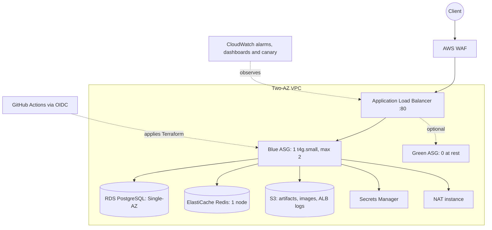

# CloudForge

CloudForge is a production-style AWS environment built in Terraform and operated through real
incidents, recovery drills and measured game days. The Go API is deliberately small; the
infrastructure, operational decisions and evidence are the product.

## What this project demonstrates

- Terraform modules for an AWS network, edge, compute, database, cache, storage, observability
  and GitHub OIDC delivery path; dev and prod use the same module set with separate state.
- Keyless CI access through GitHub OIDC, approval-gated applies, policy checks, Terraform-native
  module tests, daily drift detection and nightly dev teardown.
- A real SEV1 database-password-rotation outage, its diagnosis, the code and alerting fixes, and
  a forced-rotation verification.
- A credit-bounded operational design: ephemeral environments, final RDS snapshots, point-in-time
  recovery and deliberately documented recovery boundaries.

## As-built architecture

This is the canonical as-built diagram. It shows the deployed design, not the original plan:
there is no CloudFront, Multi-AZ RDS, NAT Gateway or permanently running two-instance fleet.

The complete diagram and the supporting network, traffic, data and security flows are in
[the architecture documentation](docs/diagrams/architecture-high-level.md).

## Evidence, not claims

| Result | Evidence |
|---|---|
| Database password rotation caused a full outage for about 40 hours; its alarm gap was fixed. | [SEV1 incident review](docs/incidents/2026-09-30-db-password-rotation.md) |
| The rotation fix survived a forced password rotation on the same instance. | [Incident verification](docs/incidents/2026-09-30-db-password-rotation.md#verification) |
| A rolling-deploy ordering fix reduced a dev rollout from 198 ALB errors to zero. | [ADR-026](docs/adr/026-environments-rebuild-themselves.md) |
| A prod deploy gate recorded zero failed requests across 2,215 requests. | [As-built measurements](PLAN.md#10-measurements-table) |
| E1: one-instance replacement caused 3 HTTP 503s; two instances had 0 failures during replacement. | [E1 report](docs/experiments/01-instance-failure.md) |
| E2: two Redis reboot runs had 0 failed requests; p95 was 763ms and 677ms. | [E2 report](docs/experiments/02-cache-failure.md) |
| E3: the generator delivered 224.11 req/s at p95 51.09ms with 0 errors; saturation was not reached. | [E3 report](docs/experiments/03-load-and-scaling.md) |
| E4: a prod rolling refresh completed in 344s with 0 failed requests during the k6 gate. | [E4 report](docs/experiments/04-rolling-deploy.md) |
| E5/E6: point-in-time restore took 1,141s; the full rebuild phase took about 31m12s and health checks passed. | [E5 report](docs/experiments/05-database-restore.md), [E6 report](docs/experiments/06-full-rebuild.md) |

The reports distinguish measured results from honest limits: E3 is generator-bounded rather than
an application saturation claim, and the full teardown-to-ready E6 wall clock was not captured
because the `prod-down` boundaries were missing. The [game-day reports](docs/experiments/README.md)
and [recovery strategy](docs/disaster-recovery/strategy.md) contain the evidence and caveats.

## A real incident and what changed

On 2026-09-30, RDS rotated its AWS-managed master password. The application had read that
password only at boot, so new database connections began failing while the shallow ALB health
check still reported healthy. The canary failed for about 40 hours, but no alarm watched it; the
outage was discovered during a deployment.

The fix reads the current secret when a new database connection is made, logs the cause behind a
5xx response, and adds a canary-failure alarm. It was validated with a forced rotation. The full
timeline, evidence and lessons are in the [incident review](docs/incidents/2026-09-30-db-password-rotation.md).

## Operating model

CloudForge is designed around a fixed AWS credit balance, not permanent uptime:

- `dev` is destroyed nightly and rebuilt from its latest final RDS snapshot.
- `prod` is ephemeral: it is brought up for implementation, validation, experiments or demos and
  taken down otherwise.
- A planned `prod-down` preserves PostgreSQL in a final snapshot but intentionally removes product
  images, build artifacts, canary output and ALB logs. This recovery boundary is explicit in the
  [DR strategy](docs/disaster-recovery/strategy.md).

The guarded lifecycle commands and the manual point-in-time restore drill are documented in
[the disaster-recovery guide](docs/disaster-recovery/README.md).

## Trade-offs

| Area | Current choice | Why |
|---|---|---|
| Edge | HTTP ALB with regional WAF | CloudFront was denied; a custom domain adds recurring cost. |
| App tier | One instance at rest, max two | Keeps the fixed credit burn down; game day E1 measures the availability cost. |
| Database | Single-AZ RDS with one-day automated backups | Multi-AZ and longer retention exceed the project budget and Free-plan limit. |
| Egress | One NAT instance | A NAT Gateway costs more than the short-lived sessions justify. |
| Recovery | Backup and restore | No duplicate always-on stack; RDS-native restore is measured rather than assumed. |

The complete list of accepted risks and production-grade alternatives is in
[PLAN.md](PLAN.md#62-conscious-compromises).

## Repository guide

- [As-built record and finishing plan](PLAN.md)
- [Architecture decision records](docs/adr/README.md)
- [Security and Well-Architected review](docs/security/README.md)
- [SLOs, alarms and runbooks](docs/observability/README.md)
- [Game-day evidence](docs/experiments/README.md)
- [Disaster recovery](docs/disaster-recovery/README.md)
- [Terraform environments](terraform/environments/)
- [CloudStore API](app/README.md)

## Current close-out status

The infrastructure and its core operational controls are built. E1–E6, the point-in-time restore,
the prod rebuild and the M13 cost/SLO evidence are recorded. Remaining work is deliberately
narrow: record the short demo, finish repository/profile polish, and optionally repeat the
point-in-time drill or measure a three-day resting-cost window. The authoritative status and
completion criteria are in [PLAN.md](PLAN.md).
