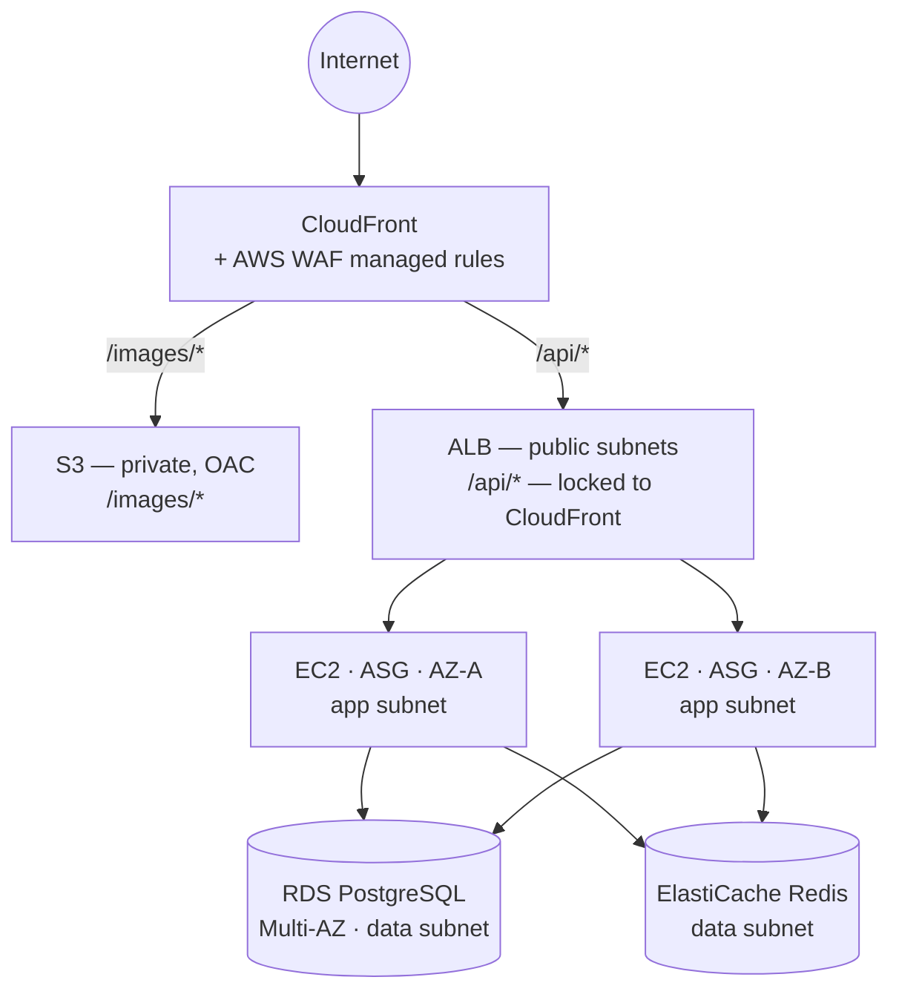

# High-Level Architecture

Target design (`PLAN.md` §5). This is the **pre-implementation** version — expect details here to firm up, and possibly change, as M1–M6 are actually built. Update this file when they do; don't let it drift from reality.

**Cross-cutting, not shown above** (full breakdown in `PLAN.md` §5):

| Observability | Security | Resilience |
|---|---|---|
| CloudWatch metrics + logs | IAM least privilege | AWS Backup + cross-region copy |
| Alarms → SNS → email | Secrets Manager + rotation | AWS FIS experiments |
| Synthetics canary | SSM Session Manager | SSM Automation runbooks |
| SLO dashboard | CloudTrail, GuardDuty | Automated restore testing |

Everything above is provisioned by Terraform; both environments are ephemeral.
