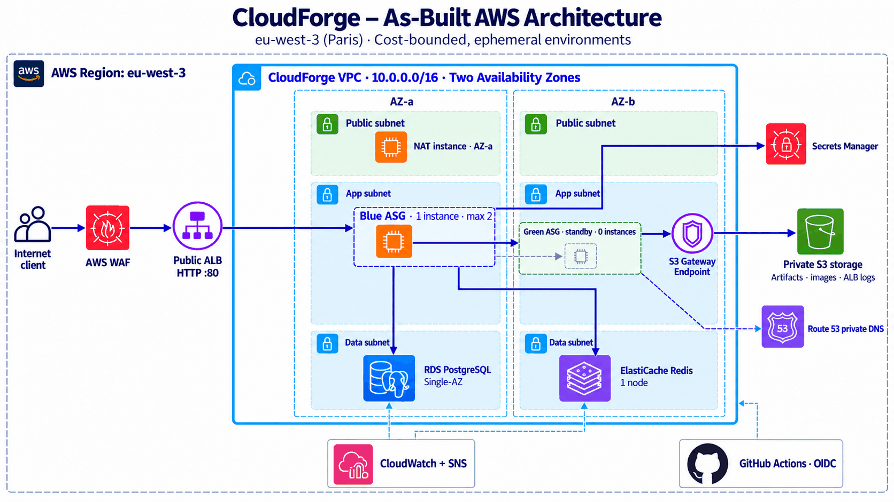
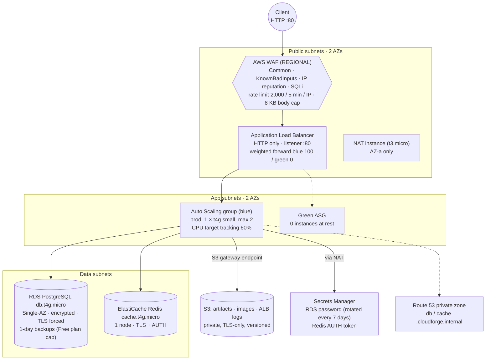

# High-Level Architecture — as built

**This is the canonical architecture diagram.** It shows what is deployed today. CloudFront was
denied by AWS Support (ADR-025); the platform uses Single-AZ RDS and one application instance at
rest as intentional budget-conscious trade-offs.

## Rendered overview

Editable Mermaid source

```mermaid
flowchart TB
    Client(("Client<br/>HTTP :80"))

    subgraph Edge["Public subnets · 2 AZs"]
        WAF{{"AWS WAF (REGIONAL)<br/>Common · KnownBadInputs · IP reputation · SQLi<br/>rate limit 2,000 / 5 min / IP · 8 KB body cap"}}
        ALB["Application Load Balancer<br/>HTTP only · listener :80<br/>weighted forward blue 100 / green 0"]
        NAT["NAT instance (t3.micro)<br/>AZ-a only"]
    end

    subgraph App["App subnets · 2 AZs"]
        ASG["Auto Scaling group (blue)<br/>prod: 1 × t4g.small, max 2<br/>CPU target tracking 60%"]
        Green["Green ASG<br/>0 instances at rest"]
    end

    subgraph Data["Data subnets"]
        RDS[("RDS PostgreSQL db.t4g.micro<br/>Single-AZ · encrypted · TLS forced<br/>1-day backups (Free plan cap)")]
        Redis[("ElastiCache Redis cache.t4g.micro<br/>1 node · TLS + AUTH")]
    end

    S3[("S3: artifacts · images · ALB logs<br/>private, TLS-only, versioned")]
    SM["Secrets Manager<br/>RDS password (rotated every 7 days)<br/>Redis AUTH token"]
    DNS["Route 53 private zone<br/>db / cache .cloudforge.internal"]

    Client --> WAF --> ALB --> ASG
    ALB -.-> Green
    ASG --> RDS
    ASG --> Redis
    ASG -->|S3 gateway endpoint| S3
    ASG -->|via NAT| SM
    ASG -.-> DNS
```

**Cross-cutting, not shown above:**

| Observability | Security | Delivery |
|---|---|---|
| CloudWatch agent, JSON app logs | IAM least privilege, SSM only, IMDSv2 | GitHub Actions with OIDC, approval-gated applies |
| 12 metric alarms + composite → SNS → email | WAF on the ALB, security-group chain | Rolling deploy with a k6 gate (`scripts/deploy.sh`) |
| Golden Signals and SLO dashboards | CloudTrail, Access Analyzer, VPC Flow Logs | Daily drift check, nightly dev destroy |
| Synthetics canary on the ALB + `canary-failed` alarm | Encryption at rest and in transit behind the ALB | Rebuilt environments converge on their own (ADR-026) |

Everything above is provisioned by Terraform. Dev is destroyed nightly, and prod is brought up
for implementation, validation, and demonstrations before being torn down.

Detail diagrams: [`network-vpc.md`](network-vpc.md), [`traffic-flow.md`](traffic-flow.md),
[`data-flow.md`](data-flow.md), [`security-flow.md`](security-flow.md).
