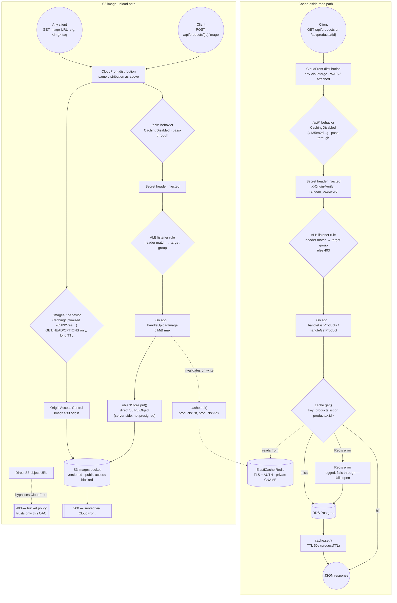

# Data Flow — cache-aside reads and the S3 image-upload path (M6)

As-built for `dev`. Two flows through the same CloudFront distribution and the same `/api/*` behavior diverge once they reach the app — one is a Redis-backed read with a Postgres fallback, the other is a write that lands in S3 and is served back out through a second, app-bypassing origin.

## Why

The read path and the upload path share one CloudFront distribution and one `/api/*` behavior, both locked down with `CachingDisabled` and the same secret-header trick used for the rest of the API (ADR-014) — CloudFront never caches API responses itself, and the ALB refuses anything that didn't arrive through this specific distribution. Caching happens one layer down, in Redis, where the app controls TTL and invalidation explicitly instead of trusting an edge cache with data that changes on every write.

The cache-aside pattern is deliberately fail-open: a Redis error is logged and treated as a miss, not an error. Losing the cache should degrade the app to "every request hits Postgres directly", not take the app down — a self-inflicted outage from a caching layer is a worse failure mode than the caching layer just not helping for a while.

The image-upload path only shares the ALB/app hop with the read path because the *write* has to run through app logic (size limit, key generation, cache invalidation for the product it belongs to). Once the bytes are in S3, there is no reason to route reads back through the app at all — the `/images/*` behavior points a second CloudFront origin straight at the S3 bucket via OAC, so image bytes never touch the ALB, the ASG, or Redis. That split is also why the bucket policy has to trust the OAC specifically: hitting the S3 object URL directly, bypassing CloudFront, is the thing OAC exists to block.

## Verified against the real `dev` infrastructure

- `terraform/modules/edge/main.tf` — `aws_cloudfront_distribution.app`: one `origin` block for `alb` (custom origin, `origin_protocol_policy = "http-only"`, secret `custom_header`) and one for `images-s3` (`origin_access_control_id = aws_cloudfront_origin_access_control.images.id`, no custom origin config).
- Same file — `ordered_cache_behavior` for `/api/*` uses the AWS-managed `CachingDisabled` policy `4135ea2d-6df8-44a3-9df3-4b5a84be39ad`; `/images/*` uses `CachingOptimized` policy `658327ea-f89d-4fab-a63d-7e88639e58f6` and restricts `allowed_methods` to `GET`, `HEAD`, `OPTIONS`.
- `app/main.go` — route table confirms `POST /api/products/{id}/image` is the only image-related route the app exposes; there is no app route for reading image bytes back.
- `app/cache.go` — `productTTL = 60 * time.Second`; `get()` logs a warning and returns `(_, false)` on any Redis error rather than propagating it, confirming the fail-open behavior shown on the diagram.
- `app/handlers.go` — `handleListProducts`/`handleGetProduct` call `cache.get`/`cache.set` against `products:list` / `products:<id>`; `handleCreateProduct`, `handleDeleteProduct`, and `handleUploadImage` all call `cache.del` on those same keys.
- `app/objects.go` — `objectStore.put()` calls `s3.PutObject` directly from the app process; confirms the upload is a server-side write, not a presigned-URL pattern.
- `curl` a direct S3 object URL for an uploaded image → `403`; the same object via the CloudFront domain (`/images/<key>`) → `200`. (Screenshot pending — this exact comparison is queued in `docs/screenshots/06-cache-storage-cdn/s3-403-vs-cloudfront-200.png`, blocked on the CloudFront distribution actually existing — see M6 status.)

See ADR-010 (`docs/adr/010-cloudfront-two-origins.md`) for why this is one distribution with two origins rather than two distributions, ADR-013 (`docs/adr/013-private-hosted-zone.md`) for the private CNAME behind the Redis connection, and ADR-014 (`docs/adr/014-alb-locked-to-cloudfront.md`) for the secret-header lockdown reused by both the read and upload paths here.
