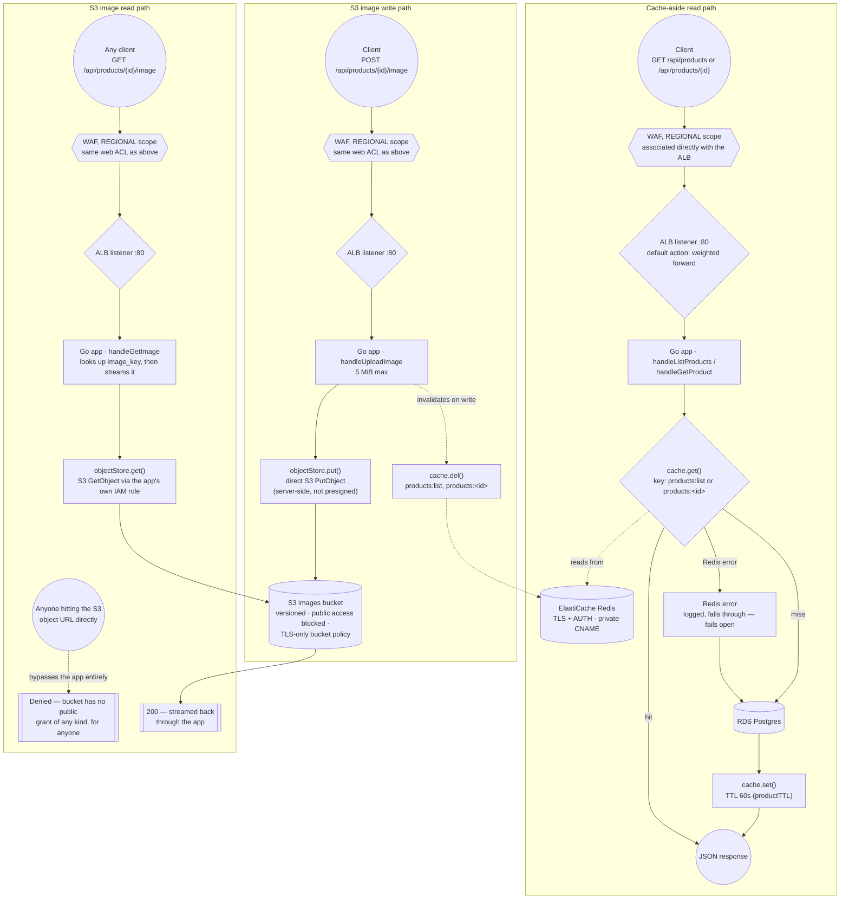

# Data Flow — cache-aside reads and the S3 image path (redesigned, ADR-025)

**Status: redesigned in code, not yet applied to `dev` or `prod`.** M6's diagram showed images
served straight out of S3 through CloudFront's Origin Access Control. AWS Support permanently
denied CloudFront access (ADR-025), so image reads now go through the app instead — the same
route the read and write paths already used for everything else. Once applied, the "To verify"
section below needs to be run for real and this note removed.

## Why

Every path — reads, the image write, and now the image read — goes through the same WAF and the
same ALB listener. That wasn't true before: M6's `/images/*` behavior deliberately bypassed the
ALB, the ASG and Redis entirely, going straight from CloudFront to S3 via OAC, because CloudFront
could authenticate itself to S3 without the app's involvement. Nothing else in this project can
do that — the app is what's allowed to reach the images bucket (`s3:GetObject`, granted to its
IAM role since M3), so once CloudFront is gone, routing image reads through the app is the only
way to keep the bucket private *and* keep image traffic covered by the WAF and the rate limit,
rather than either serving from a public bucket or handing out presigned URLs that skip both.

The cache-aside pattern is unchanged and still deliberately fail-open: a Redis error is logged and
treated as a miss, not an error. Losing the cache should degrade the app to "every request hits
Postgres directly," not take the app down.

## To verify, once this is applied

- `terraform/modules/edge/main.tf` — one `aws_wafv2_web_acl` (`REGIONAL` scope) associated with
  `aws_lb.app` via `aws_wafv2_web_acl_association`; the listener's `default_action` forwards
  directly, weighted across the blue and green target groups.
- `app/objects.go` — `get()` calls `s3.GetObject` and returns the body plus the stored content
  type; `app/handlers.go` — `handleGetImage` looks up the product's `image_key`, then streams it.
- `curl http://<alb-dns-name>/api/products/<id>/image` → `200` with the right `Content-Type`, for
  a product that has an image.
- A direct S3 object URL for the same key → denied — the bucket has no public grant of any kind
  now, not even a CloudFront-scoped one; only the app's own IAM role can read it.
- `app/cache.go` — `productTTL = 60 * time.Second`; `get()` logs a warning and returns `(_, false)`
  on any Redis error rather than propagating it, confirming the fail-open behavior shown above.

See ADR-025 (`docs/adr/025-cloudfront-denied-edge-redesign.md`) for why this changed, ADR-013
(`docs/adr/013-private-hosted-zone.md`) for the private CNAME behind the Redis connection, and
ADR-010/ADR-014 (superseded by ADR-025) for the CloudFront-based design this replaces.
