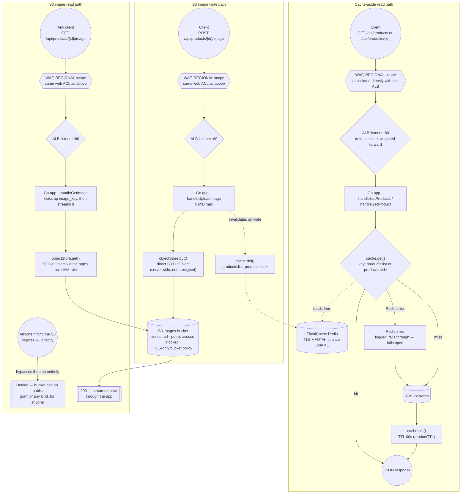

# Data Flow — cache-aside reads and the S3 image path (redesigned, ADR-025)

**Status: applied to `dev` and `prod`, verified 2026-09-24/25** (results at the bottom). M6's
diagram showed images served straight out of S3 through CloudFront's Origin Access Control. AWS
Support permanently denied CloudFront access (ADR-025), so image reads now go through the app
instead — the same route the read and write paths already used for everything else.

## Why

Every path — reads, the image write, and now the image read — goes through the same WAF and the
same ALB listener. That wasn't true before: M6's `/images/*` behavior deliberately bypassed the
ALB, the ASG and Redis entirely, going straight from CloudFront to S3 via OAC, because CloudFront
could authenticate itself to S3 without the app's involvement. Nothing else in this project can
do that — the app is what's allowed to reach the images bucket (`s3:GetObject`, granted to its
IAM role since M3), so once CloudFront is gone, routing image reads through the app is the only
way to keep the bucket private *and* keep image traffic covered by the WAF and the rate limit,
rather than either serving from a public bucket or handing out presigned URLs that skip both.

The cache-aside pattern is unchanged and still deliberately fail-open: a Redis error is logged and
treated as a miss, not an error. Losing the cache should degrade the app to "every request hits
Postgres directly," not take the app down.

## Verified 2026-09-24/25, on `dev` and `prod`

Each step below was run through the public ALB, on both environments:

- `POST /api/products` → `201` with the new product and its `id`.
- `GET /api/products/<id>/image` before any upload → `404 {"error":"product has no image"}`.
- `POST /api/products/<id>/image` → `{"image_key":"products/<id>"}`.
- `GET /api/products/<id>/image` → `200`, `Content-Type: image/png`, and the exact bytes uploaded,
  with the app's security headers (`nosniff`, `X-Frame-Options: DENY`, `Referrer-Policy`).
- The test product was deleted afterwards.

Found and fixed while verifying, both in the write path:

- **S3 `PermanentRedirect` on every upload.** The compute module passed the images bucket name to
  the IAM policy but never to the app, so the app fell back to its hardcoded default
  (`cloudforge-images-dev`, without the per-environment suffix), which is not this project's
  bucket. `user_data.sh.tpl` now sets `S3_BUCKET`.
- **The WAF rejected every upload over 8 KB.** The first tests used a 58-byte file, which hid it.
  `CommonRuleSet`'s `SizeRestrictions_BODY` now only counts, and a label rule keeps the 8 KB limit
  on every route except the upload (see `traffic-flow.md`). Re-tested on `prod` with a 20 KB file:
  `200`, and it reads back as the same 20,000 bytes.

Not yet tested: that a direct S3 object URL for the same key is denied. By design it should be,
since the bucket has no public grant of any kind and only the app's IAM role can read it.

Checked by reading code rather than by request: `app/cache.go` sets `productTTL = 60 * time.Second`,
and its `get()` logs a warning and returns `(_, false)` on any Redis error instead of propagating
it, which is the fail-open behavior shown above.

See ADR-025 (`docs/adr/025-cloudfront-denied-edge-redesign.md`) for why this changed, ADR-013
(`docs/adr/013-private-hosted-zone.md`) for the private CNAME behind the Redis connection, and
ADR-010/ADR-014 (superseded by ADR-025) for the CloudFront-based design this replaces.
