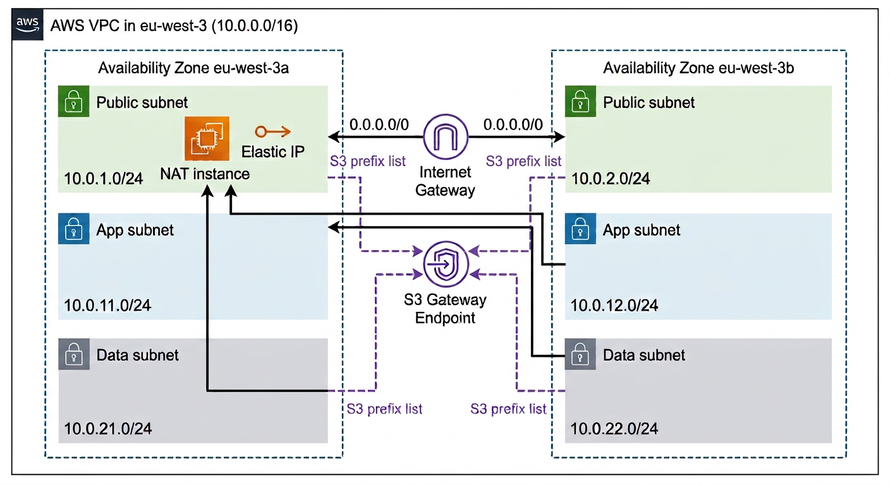

# Network / VPC — as built

As-built diagram of the `dev` network, from the actual M1 apply — not the pre-implementation target. Produced as a generated image rather than Mermaid (deliberate exception to this project's usual "diagrams as text" convention, see `README.md` in this folder) because the routing relationships (which subnets share a route table, which route goes where) came out clearer as an illustrated diagram than a flowchart graph.

## Real resource IDs (`dev`, `eu-west-3`)

| Resource | ID |
|---|---|
| VPC (`dev-cloudforge-vpc`) | `vpc-053da0b0b98e35bc3` |
| Internet Gateway (`dev-cloudforge-igw`) | `igw-0cacc84cf4e4427f3` |
| Public route table (`dev-public-rt`) | `rtb-0a0293ff6739f00c4` |
| Private route table (`dev-private-rt`) | `rtb-07b004ebf7b1b25ac` |
| S3 gateway endpoint (`dev-s3-endpoint`) | `vpce-05a2a7ee88dd6847f` |
| NAT instance (`dev-nat-instance`) | `i-0e322c66b8cf37fcf` |
| NAT Elastic IP (`dev-nat-eip`) | `13.39.231.35` |

| Subnet | CIDR | Subnet ID |
|---|---|---|
| `dev-public-a` | `10.0.1.0/24` | `subnet-079e84e376be4bc3e` |
| `dev-public-b` | `10.0.2.0/24` | `subnet-0259e7f70931fe82a` |
| `dev-app-a` | `10.0.11.0/24` | `subnet-0c8d8b7c1776b3e33` |
| `dev-app-b` | `10.0.12.0/24` | `subnet-01b981ab452beef52` |
| `dev-data-a` | `10.0.21.0/24` | `subnet-0236b27667aca9064` |
| `dev-data-b` | `10.0.22.0/24` | `subnet-0a78d6d5cf3d12d9e` |

## Routing, as actually configured

- **Public route table** (`dev-public-rt`, associated with `public-a`/`public-b`): `0.0.0.0/0 → igw-0cacc84cf4e4427f3`, plus the S3 prefix-list route to the gateway endpoint.
- **Private route table** (`dev-private-rt`, associated with all four of `app-a`/`app-b`/`data-a`/`data-b`): `0.0.0.0/0 → dev-nat-instance`'s ENI, plus the same S3 prefix-list route.
- One shared private route table, one NAT instance — `app-b` and `data-b` in `eu-west-3b` reach the internet through the NAT instance sitting in `eu-west-3a`'s public subnet. This is the single-point-of-failure trade-off documented in ADR-008: acceptable for an ephemeral `dev` box, would be a NAT Gateway per-AZ (or at least HA) in `prod`.

See ADR-001/002 (state/backend), ADR-005 (SSM access into this network), ADR-008 (NAT strategy, including the `eth0`/`ens5` forwarding bug hit while building this), and ADR-012 (why this is `dev` only, ephemeral) for the reasoning behind what's shown here.
