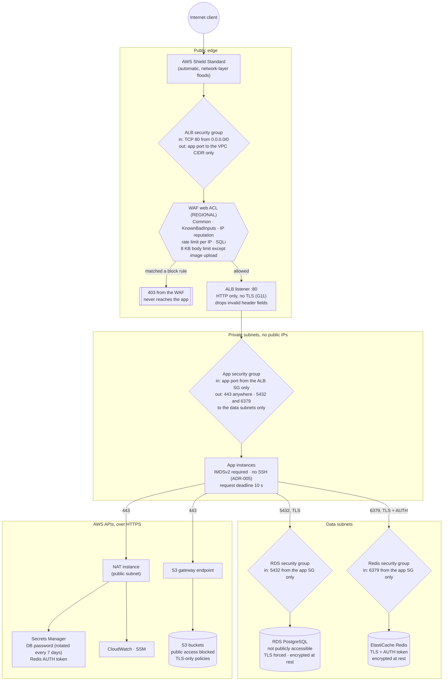
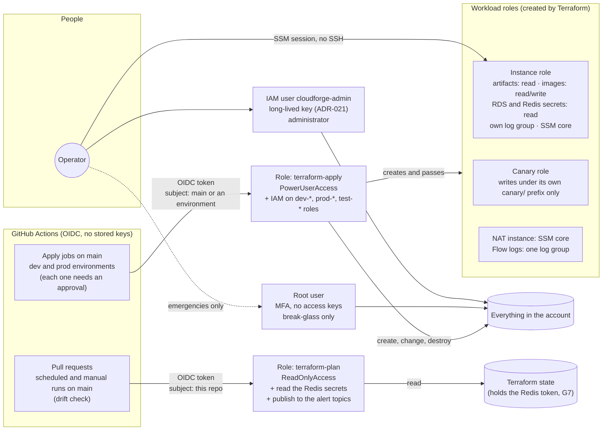

# Security Flow — WAF, the security-group chain, and IAM boundaries

**Status: as built, M10 (2026-10-02).** Drawn from the Terraform in `modules/edge`,
`modules/compute`, `modules/network`, `modules/database`, `modules/cache`, `modules/cicd-oidc`
and `terraform/bootstrap`, and from the threat model (`docs/security/threat-model.md`), whose
threat IDs (T1 to T17) are used below. Two views: what a request crosses on its way in, and who
can change what.

## 1. A request, from the internet to the data

Every hop after the first accepts traffic only from the hop before it. The first hop is open to
the whole internet on purpose: with no CloudFront (ADR-025), the ALB is the public edge.

| Hop | What stops an attacker here | Threats |
|---|---|---|
| Internet to ALB | Shield Standard; nothing else at the network layer, by design | T4 |
| WAF | Managed rule groups, SQL injection rules, per-IP rate limit, body size limit | T2, T4, T8 |
| ALB to app | Instances have no public IP; the app SG accepts only the ALB SG | T7 |
| App to data | RDS and Redis SGs accept only the app SG; TLS on both; secrets from Secrets Manager, never in config | T6, T7 |
| App to AWS APIs | The instance role (below); egress is 443 only, so no plaintext calls out | T5 |
| S3 | Public access blocked and TLS-only policies on every bucket, including the CloudTrail bucket (2026-09-30) | T7, T9 |

**Not stopped, and accepted:** the API has no authentication (T1); egress on 443 goes to any
host, so a compromised instance could exfiltrate (T5); viewer traffic is plain HTTP (G11).

## 2. Identities, and what each one can change

| Boundary | How it is enforced | Weakness | Threats |
|---|---|---|---|
| GitHub to AWS | OIDC trust policies check the audience and the immutable repository subject | A pull request from a branch in this repository can assume the plan role and read state | T10, T11 |
| Plan vs apply | Two roles, split by trigger; `apply` only from `main` or an approved environment job | The apply role can create a `dev-*` role with any policy and assume it: a guardrail, not a boundary | T12 |
| Operator | Admin key never committed (gitleaks), root kept for emergencies with MFA | A stolen admin key is full administrator | T13 |
| Workloads | One role per workload, scoped to named buckets, secrets and log groups | The app role can read both data-tier secrets, by design | T5, T6 |

## 3. What would notice an attack

| Signal | Watches | Threats |
|---|---|---|
| CloudTrail, all Regions, log file validation on (2026-09-30) | Every API call; proves the logs were not altered | T13, T14 |
| IAM Access Analyzer (`cloudforge-account`) | Any resource shared outside the account; 0 active findings | T7 |
| WAF metrics and sampled requests | Blocked requests per rule | T2, T4 |
| CloudWatch alarms, and the `canary-failed` alarm on the API itself | Availability and load | T4 |
| The `cloudforge-monthly-credit` budget, measured before credits (the CloudWatch billing alarms read 0 on credits) | Cost spikes ("denial of wallet", cryptomining on a stolen key) | T4, T13 |
| Checkov (with two custom policies), gitleaks, tflint in CI and pre-commit; daily drift check | Insecure or unexpected infrastructure changes | T12, T16 |

**Missing:** threat detection. GuardDuty, Security Hub and Inspector are unavailable on the Free
plan (`docs/security/well-architected.md`, SEC 1), so nothing analyses the flow logs or flags
unusual API use (T15).
