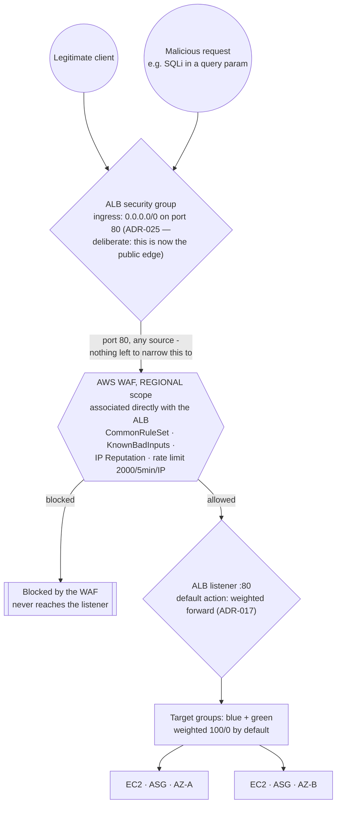

# Traffic Flow — WAF associated directly with the ALB (redesigned, ADR-025)

**Status: redesigned in code, not yet applied to `dev` or `prod`.** This replaces the M4 CloudFront
lockdown diagram after AWS Support permanently denied CloudFront access (ADR-025). Once applied,
the "To verify" section below needs to be run for real and this note removed.

The interesting part is what changed, not just what the new picture looks like: there used to be
two layers between the internet and the ALB (a security-group prefix list, then a secret header
only CloudFront could inject) because the security group alone could only prove a request came
from *some* CloudFront distribution's shared edge network, not this one specifically. With no
CloudFront, that whole problem disappears along with its solution — the ALB is simply the public
edge now, the way any internet-facing ALB with no CDN in front of it works, and the WAF is
associated with it directly.

## Why one layer is now correct, where two were needed before

The old two-layer design (`docs/adr/014-alb-locked-to-cloudfront.md`, superseded) existed because
a security-group rule scoped to CloudFront's origin-facing prefix list only proves a request came
from CloudFront's shared edge network — a range every CloudFront customer on AWS uses, including
someone else's distribution pointed at this ALB's DNS name as a custom origin. The secret header
was the actual authorization boundary, proving the request came through *this* distribution.

None of that reasoning applies once the ALB has no CloudFront in front of it to narrow the field
to in the first place. It receives the whole internet on port 80 by design (ADR-025), and the WAF
web ACL — the same four rules the old CloudFront-scoped one had, just `REGIONAL` scope now,
associated with `aws_wafv2_web_acl_association` — is what actually filters traffic before it
reaches the listener.

## To verify, once this is applied

- `curl http://<alb-dns-name>/...` should now succeed (a **200**, not a timeout) — the opposite of
  what the M4 diagram's verification checked, because the ALB's DNS name is the real public
  address now, not something meant to fail.
- A request carrying an obvious SQL-injection payload in a query parameter should get blocked by
  the WAF before it reaches the app — same managed rule groups as before, different attach point.
- `aws elbv2 describe-target-health` — both `blue` target group instances (one per AZ) report
  `healthy`.
- `aws wafv2 get-web-acl-for-resource --resource-arn <alb-arn>` confirms the web ACL association.

See ADR-025 (`docs/adr/025-cloudfront-denied-edge-redesign.md`) for the full context and decision,
ADR-006 (why the health check behind the target groups is shallow), and ADR-017 (the weighted
blue/green forward this listener's default action now carries directly).
