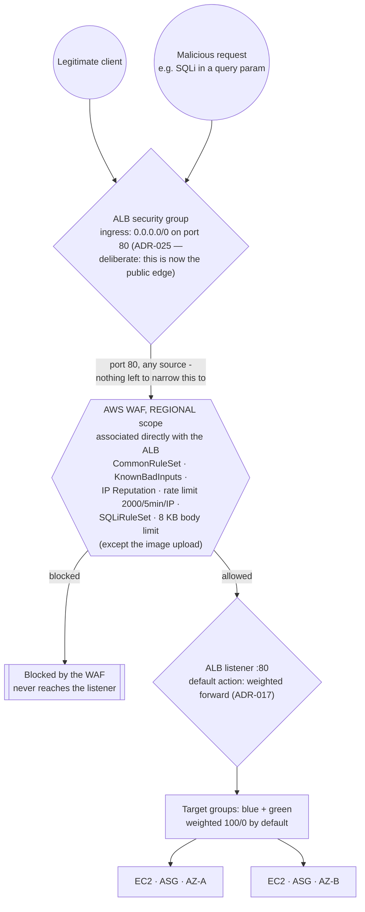

# Traffic Flow — WAF associated directly with the ALB (redesigned, ADR-025)

**Status: applied to `dev` and `prod`, verified 2026-09-24/25** (results at the bottom). This
replaces the M4 CloudFront lockdown diagram after AWS Support permanently denied CloudFront access
(ADR-025).

The interesting part is what changed, not just what the new picture looks like: there used to be
two layers between the internet and the ALB (a security-group prefix list, then a secret header
only CloudFront could inject) because the security group alone could only prove a request came
from *some* CloudFront distribution's shared edge network, not this one specifically. With no
CloudFront, that whole problem disappears along with its solution — the ALB is simply the public
edge now, the way any internet-facing ALB with no CDN in front of it works, and the WAF is
associated with it directly.

## Why one layer is now correct, where two were needed before

The old two-layer design (`docs/adr/014-alb-locked-to-cloudfront.md`, superseded) existed because
a security-group rule scoped to CloudFront's origin-facing prefix list only proves a request came
from CloudFront's shared edge network — a range every CloudFront customer on AWS uses, including
someone else's distribution pointed at this ALB's DNS name as a custom origin. The secret header
was the actual authorization boundary, proving the request came through *this* distribution.

None of that reasoning applies once the ALB has no CloudFront in front of it to narrow the field
to in the first place. It receives the whole internet on port 80 by design (ADR-025), and the WAF
web ACL is what actually filters traffic before it reaches the listener. It carries the same four
rules the old CloudFront-scoped one had, now at `REGIONAL` scope and attached with
`aws_wafv2_web_acl_association`. Testing on 2026-09-25 led to two changes:

- **`AWSManagedRulesSQLiRuleSet` added**, because none of the original four matches SQL injection.
- **`CommonRuleSet`'s 8 KB body limit (`SizeRestrictions_BODY`) set to count instead of block.**
  It rejected every image upload over 8 KB, and the app accepts up to 5 MiB. The limit is not
  gone: when that rule matches, it attaches a label to the request, and our own rule
  `OversizedBodyExceptImageUpload` blocks any request with that label unless its path is
  `/api/products/{id}/image`. So every other route keeps the 8 KB cap. That matters most for
  `POST /api/products`, whose handler reads JSON with no size limit of its own.

## Verified 2026-09-24/25, on `dev` and `prod`

- `curl http://<alb-dns-name>/api/products` returns `200` with JSON, from the internet.
- `aws wafv2 get-web-acl-for-resource --resource-arn <alb-arn>` returns
  `<env>-cloudforge-alb-waf` on both environments.
- `aws cloudfront list-distributions` is empty: nothing CloudFront-related is left.
- The WAF's sampled requests show real traffic being filtered: ordinary requests allowed, and
  scanner traffic from unrelated IPs blocked by `CommonRuleSet`'s `UserAgent_BadBots_HEADER` rule.
- **SQL injection**: before the fix, a request with `' OR '1'='1` in the query string, sent from
  AWS CloudShell, passed the WAF and got `200` from the app. After it, the same request gets
  `403` on both environments; on `dev`, the sampled requests name the blocking rule as
  `AWSManagedRulesSQLiRuleSet#SQLi_QUERYARGUMENTS`.
- **Body size**: before the fix, a 20 KB image upload got `403` from `SizeRestrictions_BODY`.
  After it, on `prod`, the upload returns `200` and reads back as the same 20,000 bytes. A 20 KB
  JSON body to `POST /api/products` gets `403` on both environments; on `dev`, the sampled
  requests show `OversizedBodyExceptImageUpload` blocking it.
- An automated scanner probing for leftover files (`/.env.bak`, `/terraform.tfstate.backup`,
  `/aws_keys.yml.bak` and similar) was blocked by `CommonRuleSet`'s
  `RestrictedExtensions_URIPATH` rule throughout. The app serves no files, so it would have found
  nothing anyway.

**Test SQL injection from CloudShell, not from your own machine.** From the operator's network,
every request containing an SQL-injection pattern got a TCP connection reset, and the WAF's
sampled requests showed none of them ever arrived. Something on that network path (security
software, the router, or the network's own firewall) drops them before they leave. Because the
ALB is plain HTTP (G11), anything on the path can read the full URL. A reset from your own machine
therefore says nothing about the WAF.

See ADR-025 (`docs/adr/025-cloudfront-denied-edge-redesign.md`) for the full context and decision,
ADR-006 (why the health check behind the target groups is shallow), and ADR-017 (the weighted
blue/green forward this listener's default action now carries directly).
