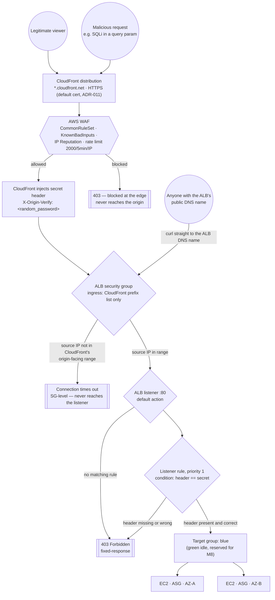

# Traffic Flow — CDN → WAF → ALB lockdown (as built, M4)

As-built for `dev`. The interesting part isn't the happy path — it's what happens to a request that skips CloudFront entirely, and why WAF sees a request before the origin ever does.

## Why two lockdown layers, not one

The security group rule (`com.amazonaws.global.cloudfront.origin-facing` prefix list) only proves a request came from *some* CloudFront distribution's edge network — that IP range is shared by every CloudFront customer on AWS, including someone else's distribution pointed at this ALB's DNS name as a custom origin. The secret header is what proves the request came through *this* distribution specifically. Full reasoning in ADR-014.

## Verified against the real `dev` infrastructure

- `curl http://<alb-dns-name>/...` (the `Direct` path above) — connection times out at the security-group layer, confirming `SGBlock` is real and not just a diagram.
- `aws elbv2 describe-target-health` — both `blue` target group instances (one per AZ) report `healthy`.
- The `Rule` node's condition is `aws_lb_listener_rule.from_cloudfront`, priority 1, matching `var.origin_secret_header_name` against `random_password.origin_secret.result` — see `terraform/modules/edge/main.tf`.

See ADR-006 (why the health check behind `TG` is shallow), ADR-010 (this distribution gains a second origin in M6 — not shown here since it doesn't exist yet), ADR-011 (why HTTPS here is the free default certificate), ADR-013 (private DNS, orthogonal to this flow), and ADR-014 (the two-layer lockdown itself) for the decisions behind what's shown here.
