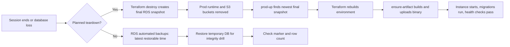

# Disaster recovery strategy

**Status:** recovery targets set before the first drill. Actual RPO and RTO remain pending.
**Scope:** the CloudForge environment in `eu-west-3`; this is a credit-bounded portfolio
workload, not a multi-Region production service.

## Recovery objective

CloudForge uses **backup and restore**. When a session ends, `make
CONFIRM_PROD_DOWN=YES prod-down` takes the RDS final snapshot through Terraform's normal destroy
path and removes the running environment. `make prod-up` accepts only the newest available
`prod-cloudforge-db-final-*` snapshot, rebuilds the environment, and runs
`scripts/ensure-artifact.sh prod`.

The final snapshot protects the PostgreSQL database only. A planned teardown deliberately deletes
the environment's S3 buckets: product images, application artifacts, canary output, and ALB
access logs are not part of the recovery point. The application binary is rebuilt from this
repository; product rows whose `image_key` points to a deleted object remain valid database rows
but their image is unavailable. CloudForge has no customer accounts, orders, payments, or private
application data. This is an accepted project boundary, recorded in
[`../security/data-classification.md`](../security/data-classification.md).

## Targets set before the drills

| Scenario | Target | Why | Actual |
|---|---:|---|---|
| Unplanned database loss | RPO <= 15 minutes | RDS point-in-time restore is the recovery path while the database exists. | Pending M11.3 |
| Planned prod teardown, PostgreSQL rows | RPO = 0 | Terraform requires a final RDS snapshot before deletion. | Pending E6 |
| Planned prod teardown, S3 objects and operational logs | No recovery target | `prod-down` intentionally deletes them to make the environment truly ephemeral. | Pending E6 confirmation |
| Point-in-time database restore | RTO <= 60 minutes | Includes restoring a temporary instance and verifying the marker and row count. | Pending M11.3 |
| Full environment restore from a final snapshot | RTO <= 45 minutes | Measures `prod-up` through a healthy application after the artifact is present. | Pending E6 |

The point-in-time target is allowed more time than the full-rebuild target because it is a
separate, integrity-checked database drill. Neither target is a measured result yet.

## Why backup and restore

| Approach | RPO / RTO characteristics | Cost and fit | Decision |
|---|---|---|---|
| Backup and restore | RPO is bounded by the one-day automated-backup window for unplanned loss; planned RDS teardown has a final snapshot. RTO includes rebuilding the environment. | No always-on duplicate stack; compatible with D1 and the remaining credit. | Chosen |
| Pilot light | A minimal database or other core service remains running. | Reduces some startup work but still spends credit while idle and adds a second operating mode. | Rejected |
| Warm standby | A smaller complete stack runs continuously. | Better RTO, but duplicates the fixed NAT, database, cache, ALB and monitoring costs that D1 removes. | Rejected |
| Active-active | Two serving stacks, normally in separate Regions. | Best resilience, but needs multi-Region data design, replication, routing and a budget far beyond this project. | Not built; cross-Region snapshot copy remains NICE work. |

## Recovery flow

## Capacity risk and mitigation

Capacity is a real part of recovery time, not a theoretical footnote. On 2026-10-03, three
attempts to restore dev's `db.t4g.micro` on gp2 failed with
`InsufficientDBInstanceCapacity`; dev then moved to gp3. A later dev rebuild also received the
same AWS capacity error for gp3. Therefore a snapshot being available does not prove that a
restore can start immediately.

`scripts/restore-test.sh` records every attempted instance class, storage type and Availability
Zone in a timestamped timeline outside the repository. It tries the live configuration first,
then tries the other gp storage type and the DB subnet group's other Availability Zone, and
finally the orderable `db.t3.micro` class, only after an explicit
`InsufficientDBInstanceCapacity` error. The timeline includes failed capacity attempts, so a
successful fallback is never presented as if the first configuration had capacity. No capacity
result is claimed until the point-in-time drill succeeds. On 2026-10-05 the first prod drill
reached the restore request, but RDS rejected it with `InstanceQuotaExceeded`: the Free plan
had no additional DB-instance slot for the temporary target. The source marker was removed by
the cleanup path, and no restore duration or integrity result is claimed. A retry requires a
free RDS instance slot (for example, `make dev-down` before retrying the prod drill, followed
by `make dev-up` to restore dev from its final snapshot) or an account-plan change.
After dev was torn down and the drill was retried on 2026-10-05, RDS accepted the account
slot but reported `InsufficientDBInstanceCapacity` for gp2 and gp3 in both `eu-west-3a` and
`eu-west-3b`. The marker was cleaned up; no temporary instance, restore duration or integrity
result exists from that attempt either.
On 2026-10-06 the `db.t3.micro`/gp2 fallback was accepted. RDS emitted restoration and
backup-complete events, but the backup finished after the drill's original 30-minute wait;
the script deleted the target at timeout before endpoint/row verification. The default wait is
now 60 minutes, matching the RTO target, and this attempt still has no measured restore result.

## What is measured next

1. After a free RDS instance slot and a capacity window are available, run
   `scripts/restore-test.sh prod` twice on different days: marker timestamp, latest restorable
   time, restore duration, row count and marker integrity.
2. Run one complete `prod-down` / `prod-up` cycle, recording the UTC boundary timestamps printed
   by the Make targets and the time to a healthy application.
3. Compare actual values with the targets above, including misses, in this document and the
   corresponding experiment report.

## Non-goals

This strategy does not claim cross-Region recovery, preservation of planned-teardown S3 data,
continuous availability during recovery, or an automated weekly restore test. Those would either
need additional always-on infrastructure or conflict with D1's credit-saving lifecycle.
