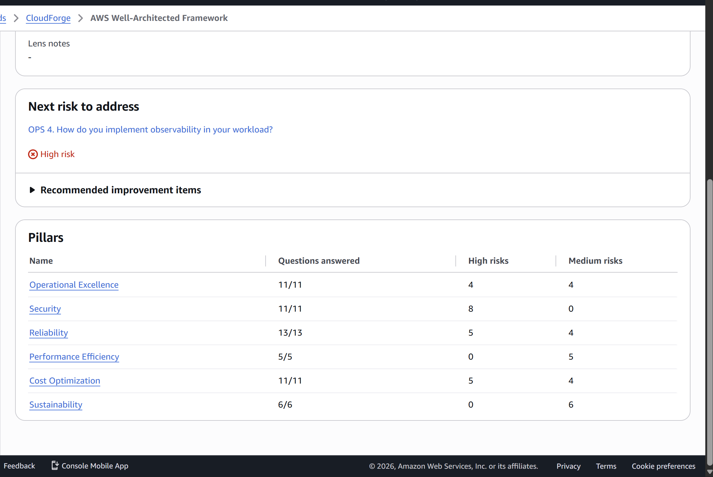

# Well-Architected review

**Workload:** `CloudForge` in the AWS Well-Architected Tool (eu-west-3), AWS Well-Architected
Framework lens. **Reviewed:** 2026-09-27 (M10). **Baseline saved as milestone 1**, "M10 baseline
2026-09-27", so later remediation shows up as a difference against it.

## Baseline

| Pillar | Questions | High risk | Medium risk | No risk |
|---|---|---|---|---|
| Operational Excellence | 11 | 4 | 4 | 3 |
| Security | 11 | 8 | 0 | 3 |
| Reliability | 13 | 5 | 4 | 4 |
| Performance Efficiency | 5 | 0 | 5 | 0 |
| Cost Optimization | 11 | 5 | 4 | 2 |
| Sustainability | 6 | 0 | 6 | 0 |
| **Total** | **57** | **22** | **23** | **12** |

## How the questions were answered

Every answer was checked against what is actually deployed: the Terraform in this repository,
the ADRs, and the account itself (root MFA, IAM users and keys, CloudTrail, Access Analyzer
findings). Each question carries a note in the tool saying what the workload does and naming
what it does not. A practice was ticked only if it is in place today, not if it is planned.

**21 best practices are marked "not applicable"**, each with its reason recorded in the tool.
Only practices that cannot apply to this workload were marked, for four reasons: it is a
one-person project (no teams, escalation chain or finance partner), it has a single VPC (nothing
to peer or overlap), there is no on-premises network, and the account is not in an AWS
Organization. A practice the workload *could* adopt but doesn't stays a gap, even when a
constraint explains it. The first pass, without these, scored 30 high risks. The 8 it removed
were practices that cannot exist here, not problems.

## High-risk findings

Every high-risk question is listed with the practices it is missing and a decision: **fix in
M10**, **evaluate in M10**, **accepted** (with the reason), or **planned** for a later milestone
that already covers it.

### Fix in M10

| Question | Missing | Remediation |
|---|---|---|
| SEC 7 - How do you classify your data? | No classification scheme, no controls tied to sensitivity, no lifecycle definition | Write the data classification: what each store holds (product catalogue, images, secrets, logs, backups), its sensitivity, and the controls and retention that follow from it. |
| SEC 10 - How do you anticipate, respond to, and recover from incidents? | Incident management plan, security playbooks, forensics, pre-provisioned access, simulations, learning framework, pre-deployed tools | Write a security incident response plan and playbooks for the likely incidents: leaked access key, exposed resource found by Access Analyzer, WAF attack, compromised instance (isolate, snapshot the volume for forensics, replace). Simulations are M12's game days. |
| OPS 10 - How do you manage workload and operations events? | An incident/problem process; prioritisation by business impact | Covered by the same plan: severity levels tied to the SLOs in `docs/observability/slo.md`. |
| OPS 7 - How do you know that you are ready to support a workload? | Operational readiness review, investigation playbooks, support plan | An operational readiness checklist that gates prod changes, and the playbooks above. The support plan stays Basic (see accepted). |
| REL 8 - How do you implement change? | A runbook for deployments; resiliency testing in the pipeline | A deployment runbook: normal deploy, blue/green, failed deploy and rollback. Resiliency testing is M12. |

Also fixed in M10, although the question stays high risk because of the accepted Multi-AZ gap
(REL 10): **prod's CI-deployed settings**. Deletion protection (database and ALB), 30-day log
retention and deferred database changes (`apply_immediately = false`) existed only in a local,
gitignored `terraform.tfvars` that CI never reads, so the prod that CI deploys ran without them.
They are now the defaults of `terraform/environments/prod`. The same file asked for 7-day
backups, but applying that failed: **the AWS Free plan caps RDS automated backups at 1 day**
(`FreeTierRestrictionError`, 2026-09-27), so prod keeps 1 day and longer recovery points are
M11's job.

### Evaluate in M10

| Question | Missing | Question to answer |
|---|---|---|
| OPS 4 - How do you implement observability? | Distributed tracing | Whether AWS X-Ray (its free tier records 100,000 traces a month) is worth instrumenting a single service with two dependencies. |
| REL 5 - How do you mitigate interaction failures? | Retry limits, fail fast, client timeouts, emergency levers | Whether the app's Postgres and Redis calls have deadlines. Health checks do (500 ms, 2 s), and the Redis read path already fails open to Postgres, but request handlers have not been audited. |
| REL 4 - How do you prevent interaction failures? | Loose coupling, idempotent mutations, constant work | Whether `POST /api/products` should take an idempotency key, so a retried request cannot create a duplicate. |

### Accepted

| Question | Missing | Why it is accepted |
|---|---|---|
| SEC 1 - How do you securely operate your workload? | Separate accounts for dev and prod; security services | Separate accounts need AWS Organizations, which moves the account off the Free plan and forfeits its remaining credit (ADR-021). GuardDuty, Security Hub and Inspector are unavailable on the Free plan (checked 2026-09-27: `SubscriptionRequiredException`). Partly compensated: IAM Access Analyzer (0 active findings), Checkov with two custom policies in CI, daily drift detection, CloudTrail in all Regions, billing alarms. |
| SEC 2 - How do you manage identities? | Strong sign-in and temporary credentials for the one human identity; central identity provider; rotation | ADR-021: IAM Identity Center requires an Organization (same forfeit). The admin user `cloudforge-admin` has a long-lived access key and no console password; root has MFA and no access keys. Every machine identity (CI, EC2) already uses temporary credentials. |
| SEC 3 - How do you manage permissions? | Least privilege for the CI apply role and the admin user; guardrails; lifecycle; emergency access | The apply role is `PowerUserAccess` plus a hand-scoped IAM policy; writing a least-privilege policy for everything Terraform manages is a large effort for a one-person project. No SCPs without an Organization. Root with MFA is the break-glass identity. |
| SEC 6 - How do you protect your compute resources? | Vulnerability scanning, hardened images, signed artifacts | Inspector needs the paid plan. Instances are immutable and launch from the newest Amazon Linux 2023 AMI; dev on every rebuild after the nightly destroy, prod on every deploy. No SSH (SSM only), IMDSv2 required. |
| SEC 9 - How do you protect your data in transit? | TLS from clients to the ALB | ADR-025: AWS Support denied CloudFront to this account, and an ACM certificate needs a custom domain, rejected on cost (ADR-011). Everything behind the ALB is encrypted: RDS enforces TLS (`rds.force_ssl`), Redis uses TLS with an AUTH token. |
| SEC 11 - How do you validate application security? | Penetration testing, code review, pipeline assessment, training | One developer, so no second reviewer. Automated checks run on every change instead: Checkov, gitleaks, tflint, Go tests. The WAF's SQL injection rules were tested by hand. |
| REL 10 - How do you use fault isolation? | Multiple locations for the running workload | The ALB spans two AZs, and the app's Auto Scaling group can launch in either, but prod runs one instance; RDS, Redis and the NAT instance are single-AZ. A second instance, Multi-AZ RDS and a second Redis node would roughly double the running cost with about 80 USD of credit left. Recovery is by restore instead: final snapshots and automated backups, exercised every time dev is rebuilt after the nightly destroy (ADR-026). |
| COST 2 - How do you govern usage? | Account structure | Same Organizations constraint as SEC 1. |
| COST 7 - How do you use pricing models? | Pricing model analysis | Savings Plans and Reserved Instances need one- or three-year terms, against a four-month project paid for by credits. |

The one medium risk worth naming: **rolling deploys have no automatic rollback** (OPS 6). It
is not a setting to switch on: `scripts/deploy.sh` overwrites one fixed S3 key and creates an
unchanged launch template version, so the ASG's own rollback would relaunch instances that
download the new binary again. The manual rollback (restore the previous S3 object version,
then refresh) is now in `docs/runbooks/deployment.md`; making it automatic needs one S3 key per
version and is left for later. Blue/green deploys can already roll back instantly by shifting
the ALB weights back (ADR-017).

### Planned in later milestones

| Question | Missing | Milestone |
|---|---|---|
| REL 13 - How do you plan for disaster recovery? | Recovery objectives, a DR strategy, a tested DR | M11 (backup and DR), M13 (DR validation) |
| OPS 11 - How do you evolve operations? | Continuous improvement process, metrics reviews | M12 (game day write-ups) and M14 |
| COST 3 - How do you monitor cost and usage? | Detailed billing data, cost KPIs | M14 (cost analysis) |
| COST 8 - How do you plan for data transfer charges? | Data transfer modelling | M14 |
| COST 9 - How do you manage demand? | Demand analysis | M14 |

## Found while preparing the review

Checking each answer against the live account turned up problems no question asked about
directly. All are fixed unless noted:

- **No alarm email was ever delivered.** Every alert topic was encrypted with the AWS-managed
  `alias/aws/sns` key, which CloudWatch is not allowed to use, so from M7 until 2026-09-29 every
  alarm in dev and prod logged "Failed to execute action" instead of notifying. Every runbook in
  `docs/runbooks/` starts from an email that could never arrive. Only the account-wide `$15`
  billing alarm worked, on an unencrypted topic created by hand in M0. The alert topics are now
  unencrypted (`encryption-inventory.md`, G12) and a module test keeps them that way.
  **Verification pending the apply:** force an alarm with `aws cloudwatch set-alarm-state` and
  check that its history says "Successfully executed action" and the email arrives.
- **The prod that CI deploys was not the prod in the plan.** Multi-AZ, deletion protection,
  7-day backups and 30-day logs were only in a gitignored local `terraform.tfvars`. See "Fix in
  M10" above; Multi-AZ stays off (REL 10) and 7-day backups are not allowed on the Free plan.
- **PR plans had never worked.** The first pull request (PR #1, the custom-policy demo) showed
  that the read-only plan role could not read the Redis AUTH secret it refreshes, and that the
  plan comment posted an empty output. Fixed in PR #2.
- **The daily drift check failed silently from 2026-09-19 to 09-25**, then reported a false
  "1 to add" for a canary build file on the runner's disk. Fixed in PR #2 and PR #5.
- **The nightly destroy never ran unattended.** Its job used the `dev` environment, which
  requires a reviewer, and it shared a concurrency group with `apply (dev)`: a forgotten
  approval kept dev running from 2026-09-25 to 09-27. Fixed in PR #5.
- **Real drift, found by the fixed drift check:** prod's billing-alert email subscription was
  never confirmed, so AWS deleted it after three days and prod's billing alarm notified nobody.
  Re-created and confirmed (issue #6).
- **App instances carried no project tags.** Provider `default_tags` never reach instances an
  Auto Scaling group launches; the launch template now copies them (see `policy/README.md`).
- **Not fixed: the app is never deployed to prod automatically.** `app.yml` deploys only to
  dev; prod changes only when someone runs `scripts/deploy.sh prod`. On 2026-09-29 prod was
  running a binary uploaded on 2026-09-25, older than `main`. Documented in
  `docs/runbooks/deployment.md`.
- **Not fixed:** the canary writes a report to the artifacts bucket every 5 minutes, and the
  bucket's lifecycle rule only expires *superseded* versions, so the reports are never deleted.
- **Not fixed:** a commit that only touches `terraform/bootstrap` still runs the whole
  `terraform` workflow and asks for dev and prod approvals it does not need.
